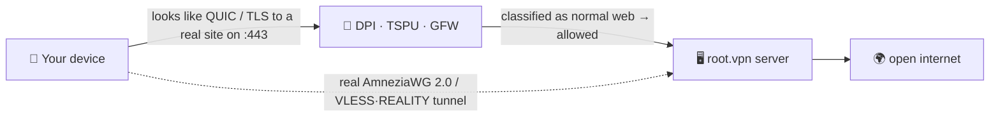

<div align="center">

# 🛡️ root.vpn

### The one‑command VPN that censorship can't see.

**AmneziaWG 2.0 + VLESS·REALITY on a single port, deployed in one line — pre‑tuned to look like ordinary internet to Russia's TSPU, China's GFW and Iran's filternet.**


<br>


**🌐 English · [Русский](README.ru.md) · [中文](README.zh.md) · [Tiếng Việt](README.vi.md)**

</div>

```bash
git clone https://github.com/antidetect/root.vpn && cd root.vpn && sudo ./awg2
```

That single line stands up a hardened road‑warrior server with **two ways in on port 443** and prints a QR you scan to connect. No flags. No web panel. No dashboards to leak.

> [!WARNING]
> **Honesty first:** AmneziaWG is UDP‑only. Where a network blocks *all* UDP, root.vpn automatically gives every client a **second TCP/443 profile (VLESS + REALITY)** so they get through anyway. Two doors, one command.

---

## ✨ Why root.vpn

- 🥷 **Invisible, not just encrypted.** Plain WireGuard/OpenVPN are trivially fingerprinted and dead in RU/CN/IR. root.vpn disguises the *opening packet* as a real **QUIC handshake to a legitimate website**, and its TCP fallback **borrows a real site's TLS** (REALITY) so an active prober just sees that real site.
- 🎲 **Unique on every server.** Junk packets, per‑message padding, ranged headers and the QUIC‑mimicry signature are **randomized per deployment** — there is no universal signature to block. Two installs never look alike.
- 🚪 **UDP *and* TCP on :443.** Fast AmneziaWG/UDP by default; VLESS+REALITY/TCP fallback for UDP‑blocked or DPI‑heavy networks — co‑located, no conflict.
- ⚡ **One command, the server does everything.** Installs the kernel module, generates keys, builds configs, opens the firewall, sets up NAT, creates your first client and prints the QR.
- 🔒 **Hardened by default.** Full‑tunnel (no leaks), `0600` secrets owned by the service user, **no access logs**, systemd sandbox, UFW + fail2ban.
- 🧾 **Yours, MIT, auditable.** A thin, readable overlay on the battle‑proven [`bivlked/amneziawg-installer`](https://github.com/bivlked/amneziawg-installer) + [Xray‑core](https://github.com/XTLS/Xray-core).

## ✅ Battle‑tested on a live server

This isn't a syntax‑checked toy. Every path was run end‑to‑end on a fresh **Ubuntu 24.04** VPS:

| Test | Result |
|---|---|
| AmneziaWG 2.0 (UDP/443) real client handshake + traffic | **egress IP = server ✓** |
| VLESS + REALITY + Vision (TCP/443) real client through SOCKS | **egress IP = server ✓** |
| IPv4 / **IPv6** / **DNS** leak checks | **no leaks ✓** |
| Firewall: UFW `deny routed`, FORWARD `DROP`+`awg0 ACCEPT`, NAT MASQUERADE | **✓** |
| fail2ban (SSH brute‑force) | **active, banning ✓** |
| Client lifecycle: add / remove / list / `rotate-reality` | **✓** |
| Idempotent re‑run across the installer's reboots | **✓** |

> The shakedown surfaced and fixed ~10 real‑world bugs (multi‑reboot handling, dependency gaps, REALITY decoy selection, file‑ownership for the service user, and more) that only a real deployment can find.

## 🧬 How it stays invisible

Your client's very first packet is a **decoy**: a genuine, per‑deploy‑unique **QUIC v1 Initial** carrying a TLS ClientHello with *your* SNI (built offline per RFC 9000/9001 — validated against the `aioquic` stack). To the censor the session opens like ordinary HTTP/3 on 443; the real AmneziaWG handshake (junk + padding + ranged headers) follows, and the server quietly ignores the decoy. The TCP fallback uses **REALITY**, which relays a real third‑party site's TLS handshake — so probing your server just returns that real site.



## ⚔️ How it compares

| | Plain WireGuard | Stock OpenVPN | Vanilla AmneziaWG | **root.vpn** |
|---|:---:|:---:|:---:|:---:|
| Survives RU/CN/IR DPI | ❌ | ❌ | ⚠️ | ✅ |
| Protocol mimicry (QUIC/REALITY) | ❌ | ❌ | ⚠️ partial | ✅ |
| Active‑probe resistant | ❌ | ❌ | ⚠️ | ✅ (REALITY) |
| TCP/443 fallback for UDP‑blocked nets | ❌ | ⚠️ | ❌ | ✅ |
| Per‑deploy unique signature | ❌ | ❌ | ⚠️ | ✅ |
| One‑command, no panel | ⚠️ | ⚠️ | ⚠️ | ✅ |
| Leak‑tested full tunnel | ⚠️ | ⚠️ | ⚠️ | ✅ |

## 🚀 Install in ~60 seconds

**You need:** a fresh **Ubuntu 24.04 / Debian 12** VPS (1 GB RAM ideal; the script adds swap if low) on a **clean‑reputation IP** (avoid burned VPS subnets), and root.

```bash
# 1) get it
git clone https://github.com/antidetect/root.vpn
cd root.vpn

# 2) (recommended) pick a low-profile REALITY decoy in defaults.conf
#    nano defaults.conf  ->  REALITY_DEST="dl.google.com"   (or leave empty for an auto-pick)
#    and a QUIC SNI:         AWG_SNI="www.cloudflare.com"

# 3) go (this is the whole install)
sudo ./awg2
```

On a fresh image the underlying installer reboots once or twice to load a new kernel — **just run `sudo ./awg2` again after each reboot**; it resumes safely. When it finishes you'll see `all checks passed`, your first client's **two QR codes**, and a `vless://` link.

> Full client walkthrough — which app on each platform and exactly how to import — is in **[docs/USAGE.md](docs/USAGE.md)** ([RU](docs/USAGE.ru.md)).

## 🎛️ Manage it

```bash
sudo awg2 add laptop                  # new client on BOTH legs → two QRs + vless:// link
sudo awg2 add guest --expires=7d      # self-expiring client
sudo awg2 remove laptop               # revoke everywhere
sudo awg2 list                        # all clients, both legs
sudo awg2 status                      # interfaces, ports, obfuscation summary
sudo awg2 rotate-sni <domain>         # fresh QUIC SNI + regen clients
sudo awg2 rotate-reality              # fresh REALITY keypair + re-export links
sudo awg2 rotate-reality-target <host># change the REALITY decoy site
sudo awg2 uninstall
```

## 📲 Connect your devices

Each client gets **two profiles** — try AmneziaWG first; use the VLESS one when UDP is blocked.

| Platform | AmneziaWG (UDP) | VLESS·REALITY (TCP) |
|---|---|---|
| Windows | AmneziaVPN | v2rayN / Hiddify |
| macOS | AmneziaVPN | Hiddify / Streisand / FoXray |
| Android | AmneziaWG / AmneziaVPN | Hiddify / v2rayNG |
| iOS | AmneziaVPN | FoXray (free) / Streisand |
| Linux | `awg-quick` / AmneziaVPN | Hiddify / NekoRay / mihomo |

👉 **Step‑by‑step import + troubleshooting + leak‑check:** [docs/USAGE.md](docs/USAGE.md) · [по‑русски](docs/USAGE.ru.md)

## 🎚️ Stealth tiers

| Tier | Stack | Best for |
|---|---|---|
| **Good** (default) | AWG/UDP + VLESS‑REALITY‑**Vision** TCP/443 | China‑leaning, speed, low user count |
| **Better** | TCP leg over **XHTTP + mux** (`TCP_TRANSPORT="xhttp"`) | Russia (survives the Nov‑2025 TSPU Vision block) |
| **Max** | + CDN‑fronted XHTTP+TLS, post‑quantum VLESS encryption | Iran whitelisting, hostile ASNs |

Details + the engineering rationale: **[docs/DESIGN‑v2‑tcp‑masking.md](docs/DESIGN-v2-tcp-masking.md)**.

## 🛡️ Hardened by default

Full‑tunnel routing · UFW (`deny routed`) + fail2ban · `net.ipv6.disable_ipv6=1` (no v6 leak) · NAT MASQUERADE + `FORWARD DROP` · REALITY private key & client secrets at `0600` owned by the service user · **Xray access log off** (no client IP/SNI on disk) · systemd sandbox (`NoNewPrivileges`, `ProtectSystem=strict`, `CAP_NET_BIND_SERVICE` only) · pinned upstreams · per‑deploy randomized obfuscation.

## ⚠️ Honest limits

- **IP/ASN reputation beats any protocol.** On burned VPS ranges the handshake completes then data dies — use a clean / residential‑reputation exit.
- **REALITY decoy choice matters.** Use a clean TLS1.3+HTTP/2 site (`dl.google.com`, `www.lovelive-anime.jp`); **avoid** huge‑cert sites (`microsoft.com`, `amazon.com`) — they break the REALITY handshake. root.vpn ships a vetted default list and validates your choice.
- **Client lock‑in.** AWG 2.0 is spoken by the Amnezia app; the TCP leg by Xray‑family apps. A single‑app auto‑failover (Mihomo) is on the roadmap.
- **Trust.** It runs pinned upstream code as root — read it, pin `UPSTREAM_SHA256` if you want.

## 📚 Docs

- 📖 [Client usage guide](docs/USAGE.md) ([RU](docs/USAGE.ru.md)) — connect any device
- 🏗️ [v2 design](docs/DESIGN-v2-tcp-masking.md) — architecture, threat mapping, tiers

## 🙏 Credits & License

Built on [`bivlked/amneziawg-installer`](https://github.com/bivlked/amneziawg-installer) and [amnezia‑vpn](https://github.com/amnezia-vpn) (AmneziaWG 2.0) + [XTLS/Xray‑core](https://github.com/XTLS/Xray-core) (VLESS·REALITY). The offline QUIC‑Initial generator follows RFC 9000/9001 and is original work. See [NOTICE](NOTICE).

**MIT** © 2026 — see [LICENSE](LICENSE). For legitimate privacy & censorship‑circumvention use; you are responsible for the laws that apply to you.
