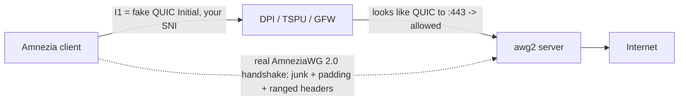

<div align="center">

# 🛡️ amneziawg-hardened &nbsp;·&nbsp; `awg2`

### One command on a fresh VPS → a road‑warrior **AmneziaWG 2.0** server, pre‑tuned to slip past *serious* DPI.


**🌐 English · [Русский](README.ru.md) · [中文](README.zh.md) · [Tiếng Việt](README.vi.md)**

</div>

> [!WARNING]
> **AmneziaWG is UDP‑only.** It mimics QUIC/DNS/SIP but has no TCP transport. On networks that block *all* UDP — or allow only TCP‑443 to a CDN — it **cannot connect**. Keep an **OpenVPN+Cloak** or **VLESS+REALITY** (TCP/443) fallback on the same box. See [Honest limits](#️-honest-limits).

---

## ✨ Why this exists

`awg2` is a thin, opinionated **overlay** on the excellent [`bivlked/amneziawg-installer`](https://github.com/bivlked/amneziawg-installer) (MIT). That installer does the heavy lifting — DKMS build, per‑deploy‑randomized `Jc/Jmin/Jmax/S1–S4/H1–H4`, client/QR generation, Russian‑carrier presets. `awg2` adds three things on top:

1. **Hardened‑by‑default** — no flags to remember. Full‑tunnel + UDP/443 are baked in.
2. **Real QUIC mimicry, offline.** Upstream punts the QUIC `I1` to a browser tool; everyone copies the same `SNI=7‑zip.org` blob, which *kills* AmneziaWG 2.0's whole point (per‑deployment uniqueness). `awg2` generates a **fresh, valid, unique QUIC v1 Initial with your own SNI** locally, every time.
3. **Version‑pinned.** Upstream churns daily; `awg2` pins it, so your hardening never rots. Bump one variable to update.

## 🎯 What "hardened" bakes in

| Knob | Default | Why |
|---|---|---|
| 🧅 Tunnel | **full** (`--route-all`) | nothing leaks around the tunnel |
| 🔌 Port | **UDP/443** | blends with QUIC / HTTP‑3 |
| 🎭 `I1` mimicry | **real QUIC Initial + your SNI** | beats DPI that *classifies* QUIC **and** DPI that *decrypts the Initial + reads SNI* (e.g. GFW) |
| 🎲 `Jc/Jmin/Jmax/S1–S4/H1–H4` | randomized **per deploy** | no universal signature; non‑overlapping `H` ranges ≤ INT32_MAX |

## 🧬 How the QUIC mimicry works

The first thing your client sends is `I1` — a **decoy packet**. `awg2` makes it a genuine QUIC Initial carrying a TLS ClientHello with *your* SNI. To the censor the session opens like ordinary HTTP/3 to port 443; the real AmneziaWG handshake (junk packets, per‑message padding, ranged headers) follows and the server quietly ignores the decoy.



## 🚀 Quickstart

```bash
git clone https://github.com/antidetect/amneziawg-hardened
cd amneziawg-hardened

# Set the one knob: a low-profile SNI for the QUIC mimicry (see defaults.conf)
#   nano defaults.conf   ->   AWG_SNI="static.licdn.com"

sudo ./awg2
```

That installs AmneziaWG 2.0, applies the hardened profile, creates a first client `phone`, and prints its QR. Import it with the **Amnezia client ≥ 4.8.12.9** (only that client speaks AWG 2.0 today).

> Leaving `AWG_SNI` empty still works — it falls back to *shape‑only* QUIC mimicry (looks like QUIC, no embedded SNI). For serious DPI, set a real SNI.

## 🔑 The one knob — your SNI

The SNI you embed is the only thing you must choose. Pick a **low‑profile** domain plausible for your exit's region, and use a **different one per deployment**.

| | Domain |
|---|---|
| ✅ **Do** | a quiet CDN / financial / gov / enterprise host (e.g. `www.gov.uk`, `static.licdn.com`, a small SaaS domain) |
| ❌ **Don't** | `youtube.com`, `*.cloudflare.com`, Discord, Telegram CDNs, `*.googlevideo.com`, STUN hosts — blocked or infra‑overlap |

It's a moving target. If a route degrades: `sudo awg2 rotate-sni new.example.com`.

## 🎛️ Commands

| Command | Action |
|---|---|
| `sudo ./awg2` | hardened install (reads `defaults.conf`) |
| `sudo awg2 add <name> [--expires=7d] [--psk]` | new client + QR |
| `sudo awg2 remove <name>` | revoke a client |
| `sudo awg2 list -v` | list clients |
| `sudo awg2 status` | interface + obfuscation summary |
| `sudo awg2 rotate-sni <domain>` | new QUIC SNI, re‑apply, regen all clients |
| `sudo awg2 rotate-i1` | fresh QUIC Initial (same SNI) |
| `sudo awg2 uninstall` | remove everything |

> After `rotate-sni` / `rotate-i1`, **re‑distribute** the updated client configs from `/root/awg/` — `I1` must be byte‑identical on server and every client. `awg2` treats a mismatch as a fatal error, so it is never silently shipped.

## 🧱 Hardened defaults (`defaults.conf`)

```ini
AWG_SNI=""              # ← set this. low-profile SNI for the QUIC mimicry
AWG_PORT="443"          # UDP/443 (blends with QUIC/HTTP-3)
AWG_TUNNEL="full"       # full = route everything | amnezia = split-tunnel
AWG_MIMICRY="quic"      # quic = real Initial+SNI | shape = QUIC-looking only | off
AWG_PRESET=""           # "" | "mobile" (RU/Iran cellular DPI)
AWG_FIRST_CLIENT="phone"
UPSTREAM_VERSION="v5.18.1"   # pinned upstream installer
```

## ✅ Verified, not hand‑waved

The offline QUIC generator [`lib/quic_i1.py`](lib/quic_i1.py) is validated three independent ways:

- 🧾 **RFC 9001 Appendix A.1** test vectors — the Initial key/iv/hp derivation matches the spec byte‑for‑byte.
- 🔁 **Round‑trip self‑test** — builds the packet, removes header protection, AEAD‑decrypts, parses the ClientHello, asserts the SNI.
- 🦺 **Independent parser (`aioquic`)** — a separate, mature QUIC stack recovers the SNI, ALPN `h3`, and cipher suites from our packet.

```bash
python3 lib/quic_i1.py --selftest          # builds → decrypts → checks SNI round-trip
python3 lib/quic_i1.py --sni www.gov.uk    # prints the I1 = <b 0x...> token
```

Each run produces a **unique** packet (random connection IDs/keys, GREASE, shuffled TLS extensions), so no two deployments share a fingerprint.

## ⚠️ Honest limits

> [!CAUTION]
> Read these before you rely on it against a state‑grade censor.

- **UDP‑only** — see the warning at the top. Keep a TCP fallback (OpenVPN+Cloak / VLESS+REALITY).
- **IP/ASN reputation dominates.** On known‑VPS ranges (e.g. Hetzner AS24940 from RU) the handshake can complete and then data dies — an AS‑level cut, not a parameter problem. Use a clean / residential‑reputation exit.
- **SNI rot.** The safe SNI is a moving target → `rotate-sni`.
- **Client lock‑in.** Only the Amnezia app speaks AWG 2.0 as of mid‑2026 (Throne/Hiddify/sing‑box do not yet).
- **Trust.** `awg2` runs a pinned upstream script as root. Read it (`less /root/awg-hardened/install_amneziawg_en.sh`) and optionally pin `UPSTREAM_SHA256` in `defaults.conf`.

## 📁 Layout

```
awg2              hardened entrypoint (install + management proxy + rotation)
defaults.conf     baked defaults you edit once (AWG_SNI is the main one)
lib/quic_i1.py    offline QUIC v1 Initial + SNI generator (RFC 9000/9001)
NOTICE / LICENSE  MIT; attribution to bivlked/amneziawg-installer & amnezia-vpn
```

## 🙏 Credits & License

Built on [`bivlked/amneziawg-installer`](https://github.com/bivlked/amneziawg-installer) and the [amnezia‑vpn](https://github.com/amnezia-vpn) project — all credit to them for the installer and the AmneziaWG 2.0 protocol. The QUIC Initial generator follows RFC 9000 / RFC 9001 and is original work. See [NOTICE](NOTICE).

**MIT** © 2026 — see [LICENSE](LICENSE). For legitimate privacy / censorship‑circumvention use; you are responsible for complying with the laws that apply to you.
