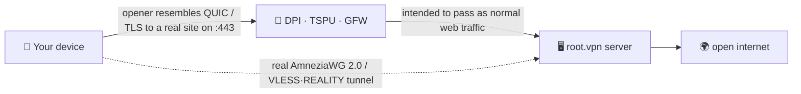

<div align="center">

# 🛡️ root.vpn

### The one‑command VPN built to blend in where plain WireGuard gets blocked.

**AmneziaWG 2.0 (UDP/443) + VLESS·REALITY (TCP/443) from a single command — using protocol‑masking designed to resemble ordinary QUIC/TLS traffic and to target the DPI techniques used in Russia, China and Iran.**


<br>

-16a34a?style=for-the-badge)


**🌐 English · [Русский](README.ru.md) · [中文](README.zh.md) · [Tiếng Việt](README.vi.md)**

</div>

> [!IMPORTANT]
> **Straight talk:** root.vpn is **engineered** to look like normal internet, and it's been **end‑to‑end tested on a real server** (see below). It has **not** been tested against live Russian/Chinese/Iranian censorship — the anti‑DPI behaviour is a *design property*, not a field‑proven result. See [Honest limits](#️-honest-limits). No snake oil here.

## Install (no git needed)

```bash
curl -fsSL https://raw.githubusercontent.com/antidetect/root.vpn/main/install.sh | sudo bash
```

That one line downloads root.vpn (via `curl`+`tar`, no git), stands up a hardened road‑warrior server on **port 443**, and prints a QR you scan to connect. No flags, no web panel, no dashboards to leak. On a fresh image the underlying installer reboots once or twice to load a new kernel — **just re‑run the same command after each reboot**; it resumes safely.

By default you get **two ways in on :443**: fast **AmneziaWG/UDP** *and* a **VLESS·REALITY/TCP** fallback for networks that block UDP (`TCP_ENABLED=1` is the default; set `0` for AWG‑only).

> [!WARNING]
> AmneziaWG is UDP‑only. Where a network blocks *all* UDP, clients use their **second profile (VLESS + REALITY on TCP/443)** to get through. Two doors, one command.

---

## ✨ Why root.vpn

- 🥷 **Built to blend in, not just encrypt.** Plain WireGuard/OpenVPN are easy to fingerprint and are widely blocked in RU/CN/IR. root.vpn disguises the *opening packet* as a real **QUIC client Initial to a legitimate website**, and its TCP leg uses **REALITY**, which relays a real third‑party site's TLS handshake — so an active prober that pokes your server just gets that real site back.
- 🎲 **No two installs look alike.** Junk packets, per‑message padding, ranged headers and the QUIC‑mimicry opener are **randomized per deployment** (connection IDs, TLS random, key share, GREASE, extension order all vary). That removes a shared static byte‑signature across servers — it does **not** claim to defeat ML/connection‑pattern classifiers.
- 🚪 **UDP *and* TCP on :443.** Co‑located, no conflict — verified both listening on a live box.
- ⚡ **One command, the server does the rest.** Installs the kernel module, generates keys, builds configs, opens the firewall, sets up NAT, creates your first client and prints the QR. (Needs root + outbound HTTPS; may reboot/resume on a fresh kernel.)
- 🔒 **Hardened by default.** Full‑tunnel routing (no leaks in our controlled test), UFW + fail2ban (upstream), and — on the TCP leg — a **systemd‑sandboxed Xray** with `0600` secrets owned by its service user and **access logging off**.
- 🧾 **Yours, MIT, auditable.** A thin, readable overlay on [`bivlked/amneziawg-installer`](https://github.com/bivlked/amneziawg-installer) + [Xray‑core](https://github.com/XTLS/Xray-core).

## ✅ End‑to‑end tested on a live server

Not just `bash -n`. Every path was run on a fresh **Ubuntu 24.04** VPS (Debian 12 is supported by the installer path but wasn't part of this shakedown):

| Test | Result |
|---|---|
| AmneziaWG 2.0 (UDP/443): real client handshake + traffic through the tunnel | **egress IP = server ✓** |
| VLESS + REALITY + Vision (TCP/443): real client via SOCKS *(with a REALITY‑friendly decoy)* | **egress IP = server ✓** |
| IPv4 / **IPv6** / **DNS** leak checks — *in a single‑host network‑namespace E2E (lab), not on real client networks* | **no leaks ✓** |
| Firewall: UFW `deny routed`, FORWARD `DROP`+`awg0 ACCEPT`, NAT MASQUERADE | **✓** |
| fail2ban (SSH brute‑force) | **active, banning ✓** |
| Client lifecycle: add / remove / list / `rotate-reality`; curl install path | **✓** |
| Idempotent re‑run across the installer's reboots | **✓** |

> The shakedown surfaced and fixed ~10 real deployment bugs (multi‑reboot handling, a missing dependency, REALITY decoy selection, service‑user file ownership, and more) that only a live run can find.

## 🧬 How it blends in

Your client's *opening packet* is a **decoy**: a genuine, per‑deploy‑unique **QUIC v1 Initial** carrying a TLS ClientHello with *your* SNI (built offline to RFC 9000/9001; its Initial keys match the RFC 9001 Appendix A.1 test vectors, and during development the packet was parsed — and the SNI recovered — by the independent `aioquic` stack). To the censor the session *starts* like an ordinary HTTP/3 client on 443; the real AmneziaWG handshake follows and the server ignores the decoy. **Caveat:** only the first packet mimics QUIC — a stateful classifier that tracks the whole flow can still tell it isn't a full HTTP/3 session. The TCP leg uses **REALITY**, where probing returns a real third‑party site.



## ⚔️ Design‑feature comparison

*Compares built‑in design features, not field results. Live‑censor evasion is not independently verified for any option here.*

| Feature | Plain WireGuard | OpenVPN (TLS/443) | Stock AmneziaWG | **root.vpn** |
|---|:---:|:---:|:---:|:---:|
| Protocol mimicry / obfuscation | ❌ | ⚠️ via plugins | ✅ | ✅ |
| Active‑probe‑resistant TLS leg | ❌ | ⚠️ tls‑crypt | ❌ | ✅ REALITY (TCP leg) |
| UDP **and** TCP on :443 | ❌ | TCP only | UDP only | ✅ both |
| Per‑deploy randomized signature | ❌ | ❌ | ⚠️ manual | ✅ |
| One command + clients + QR | ⚠️ | ⚠️ | ⚠️ | ✅ |
| Full‑tunnel, leak‑checked (lab E2E) | — | — | — | ✅ |

## 🚀 Full install

**You need:** a fresh **Ubuntu 24.04** (or Debian 12) VPS — 1 GB RAM ideal, the script adds swap if low — on a **clean‑reputation IP** (avoid burned VPS subnets), and root.

**Fastest (no git):**
```bash
# optionally pass config as env vars (a low-profile REALITY decoy + a QUIC SNI):
curl -fsSL https://raw.githubusercontent.com/antidetect/root.vpn/main/install.sh \
  | sudo REALITY_DEST=dl.google.com AWG_SNI=www.cloudflare.com bash
```

**Or download + edit, then run (also no git):**
```bash
curl -fsSL https://github.com/antidetect/root.vpn/archive/refs/heads/main.tar.gz | tar -xz
cd root.vpn-main
nano defaults.conf          # set REALITY_DEST / AWG_SNI, etc.
sudo ./awg2
```

**Or with git:**
```bash
git clone https://github.com/antidetect/root.vpn && cd root.vpn && sudo ./awg2
```

When it finishes you'll see `all checks passed`, your first client's QR codes, and a `vless://` link. Full per‑device walkthrough: **[docs/USAGE.md](docs/USAGE.md)** ([RU](docs/USAGE.ru.md)).

## 🎛️ Manage it

```bash
sudo awg2 add laptop                  # new client on both legs → QR(s) + vless:// link
sudo awg2 add guest --expires=7d      # self-expiring client
sudo awg2 remove laptop               # revoke everywhere
sudo awg2 list                        # all clients, both legs
sudo awg2 status                      # interfaces, ports, obfuscation summary
sudo awg2 rotate-sni <domain>         # fresh QUIC SNI + regen clients
sudo awg2 rotate-reality              # fresh REALITY keypair + re-export links
sudo awg2 rotate-reality-target <host># change the REALITY decoy site
sudo awg2 uninstall
```

## 📲 Connect your devices

Each client gets an **AmneziaWG profile** and (when the TCP leg is on) a **VLESS·REALITY profile** — try AmneziaWG first; use VLESS when UDP is blocked.

| Platform | AmneziaWG (UDP) | VLESS·REALITY (TCP) |
|---|---|---|
| Windows | AmneziaVPN | v2rayN / Hiddify |
| macOS | AmneziaVPN | Hiddify / v2rayN |
| Android | AmneziaWG / AmneziaVPN | Hiddify / v2rayNG |
| iOS | AmneziaVPN | Streisand (free) / Shadowrocket (paid) / Hiddify |
| Linux | `awg-quick` / AmneziaVPN | Hiddify / mihomo / `xray` |

👉 **Step‑by‑step import + troubleshooting + leak‑check:** [docs/USAGE.md](docs/USAGE.md) · [по‑русски](docs/USAGE.ru.md)

## 🎚️ Stealth options

| Option | How | Status |
|---|---|---|
| **Default** | AWG/UDP + VLESS‑REALITY‑**Vision** TCP/443 | ✅ tested baseline |
| **RU‑hardened** | TCP leg over **XHTTP** (`TCP_TRANSPORT="xhttp"`) | mitigation for reported TSPU Vision‑on‑443 blocking; **not verified vs live TSPU** |
| **CDN front / post‑quantum** | CDN‑fronted XHTTP+TLS · VLESS encryption (ML‑KEM) | **experimental / manual**, off by default, not in the tested baseline |

Engineering rationale + threat mapping: **[docs/DESIGN‑v2‑tcp‑masking.md](docs/DESIGN-v2-tcp-masking.md)**.

## 🛡️ Hardening

Full‑tunnel routing · UFW (`deny routed`) + fail2ban (upstream) · `net.ipv6.disable_ipv6=1` (no v6 leak) · NAT MASQUERADE + `FORWARD DROP`. On the TCP/Xray leg: REALITY private key + Xray config at `0600` chowned to the service user · **Xray access log off** (no client IP/SNI in its logs) · systemd sandbox (`NoNewPrivileges`, `ProtectSystem=strict`, only `CAP_NET_BIND_SERVICE`). Upstreams are version‑pinned (optional `UPSTREAM_SHA256` for hash‑pinning, off by default). Obfuscation params are randomized per deploy.

## ⚠️ Honest limits

- **Not tested against live censors.** Evasion of RU TSPU / China GFW / Iran DPI is **not** verified — anti‑DPI here is design intent + lab/functional validation, not a field result.
- **Leak checks were lab‑only.** They passed in a single‑host network‑namespace E2E, *not* across real client devices and access networks. Verify on your device (see USAGE).
- **Only the first packet mimics QUIC.** A stateful classifier that follows the whole flow can still distinguish it; REALITY's TLS‑in‑TLS is raised in cost, not made invisible.
- **IP/ASN reputation beats any protocol.** On burned VPS ranges the handshake completes then data dies — use a clean / residential‑reputation exit.
- **REALITY decoy choice matters.** Use a clean TLS1.3+HTTP/2 site (`dl.google.com`, `www.lovelive-anime.jp`); **avoid** huge‑cert sites (`microsoft.com`, `amazon.com`) — they break the REALITY handshake (proven in testing). root.vpn validates and warns, but **test your decoy before sharing clients**.
- **No throughput benchmarks** are published yet. **Debian 12** and the advanced (XHTTP/CDN/PQ) options are not part of the proven Ubuntu 24.04 baseline.
- **Client lock‑in & trust.** AWG 2.0 needs the Amnezia app; the TCP leg needs an Xray‑family app. It runs pinned upstream code as root — read it; pin `UPSTREAM_SHA256` if you want.

## 📚 Docs

- 📖 [Client usage guide](docs/USAGE.md) ([RU](docs/USAGE.ru.md)) — connect any device
- 🏗️ [v2 design](docs/DESIGN-v2-tcp-masking.md) — architecture, threat mapping, options

## 🙏 Credits & License

Built on [`bivlked/amneziawg-installer`](https://github.com/bivlked/amneziawg-installer) and [amnezia‑vpn](https://github.com/amnezia-vpn) (AmneziaWG 2.0) + [XTLS/Xray‑core](https://github.com/XTLS/Xray-core) (VLESS·REALITY). The offline QUIC‑Initial generator follows RFC 9000/9001 and is original work. See [NOTICE](NOTICE).

**MIT** © 2026 — see [LICENSE](LICENSE). For legitimate privacy & censorship‑circumvention use; you are responsible for the laws that apply to you.
