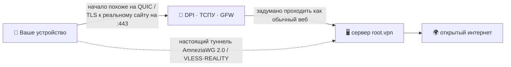

<div align="center">

# 🛡️ root.vpn

### VPN одной командой, сделанный «сливаться с фоном» там, где голый WireGuard блокируют.

**AmneziaWG 2.0 (UDP/443) + VLESS·REALITY (TCP/443) одной командой — с маскировкой протокола, спроектированной похожей на обычный QUIC/TLS‑трафик и нацеленной на методы DPI, применяемые в России, Китае и Иране.**


<br>

-16a34a?style=for-the-badge)


**🌐 [English](README.md) · Русский · [中文](README.zh.md) · [Tiếng Việt](README.vi.md)**

</div>

> [!IMPORTANT]
> **Без приукрашивания:** root.vpn **спроектирован** выглядеть как обычный интернет и **протестирован end‑to‑end на реальном сервере** (см. ниже). Он **не** тестировался против живой цензуры РФ/КН/ИР — anti‑DPI это *свойство дизайна*, а не доказанный полевой результат. См. [Честные ограничения](#️-честные-ограничения). Никакого «снейк‑ойла».

## Установка (git не нужен)

```bash
curl -fsSL https://raw.githubusercontent.com/antidetect/root.vpn/main/install.sh | sudo bash
```

Эта строка скачивает root.vpn (через `curl`+`tar`, без git), поднимает закалённый road‑warrior сервер на **порту 443** и печатает QR для подключения. Никаких флагов, веб‑панелей, дашбордов. На свежем образе нижележащий инсталлер один‑два раза перезагружается ради нового ядра — **просто запустите ту же команду снова после ребута**, он безопасно продолжит.

По умолчанию — **два входа на :443**: быстрый **AmneziaWG/UDP** *и* фолбэк **VLESS·REALITY/TCP** для сетей, где режут UDP (`TCP_ENABLED=1` по умолчанию; `0` — только AWG).

> [!WARNING]
> AmneziaWG работает только по UDP. Где режут *весь* UDP, клиенты используют **второй профиль (VLESS + REALITY на TCP/443)**. Две двери, одна команда.

---

## ✨ Почему root.vpn

- 🥷 **Сделан сливаться, а не только шифровать.** Голые WireGuard/OpenVPN легко фингерпринтятся и широко блокируются в РФ/КН/ИР. root.vpn маскирует *первый пакет* под настоящий **QUIC client Initial к легитимному сайту**, а TCP‑нога использует **REALITY**, который реле́ит TLS‑хендшейк реального стороннего сайта — активный пробер, ткнувший в ваш сервер, получает этот реальный сайт.
- 🎲 **Две установки не похожи.** Мусорные пакеты, паддинг сообщений, ranged‑заголовки и QUIC‑обманка **рандомизированы на каждый деплой** (connection ID, TLS random, key share, GREASE, порядок расширений — всё разное). Это убирает общую статическую байт‑сигнатуру между серверами — но **не** заявляет о победе над ML/connection‑pattern классификаторами.
- 🚪 **UDP *и* TCP на :443.** На одном хосте, без конфликта — проверено, оба слушают на живой машине.
- ⚡ **Одна команда — остальное делает сервер.** Ставит модуль ядра, генерит ключи, собирает конфиги, открывает фаервол, настраивает NAT, создаёт первого клиента и печатает QR. (Нужен root + исходящий HTTPS; может перезагрузиться/продолжить на свежем ядре.)
- 🔒 **Закалён по умолчанию.** Full‑tunnel (без утечек в нашем контролируемом тесте), UFW + fail2ban (от апстрима), а на TCP‑ноге — **Xray в песочнице systemd** с секретами `0600` от имени сервис‑юзера и **выключенным access‑логом**.
- 🧾 **Ваш, MIT, аудируемый.** Тонкий читаемый оверлей над [`bivlked/amneziawg-installer`](https://github.com/bivlked/amneziawg-installer) + [Xray‑core](https://github.com/XTLS/Xray-core).

## ✅ Протестирован end‑to‑end на живом сервере

Не просто `bash -n`. Каждый путь прогнан на свежем **Ubuntu 24.04** (Debian 12 поддерживается путём инсталлера, но в этой обкатке не участвовал):

| Тест | Результат |
|---|---|
| AmneziaWG 2.0 (UDP/443): реальный хендшейк клиента + трафик через туннель | **egress IP = сервер ✓** |
| VLESS + REALITY + Vision (TCP/443): реальный клиент через SOCKS *(с подходящим REALITY‑decoy)* | **egress IP = сервер ✓** |
| Утечки IPv4 / **IPv6** / **DNS** — *в single‑host network‑namespace E2E (lab), не на реальных клиентских сетях* | **нет утечек ✓** |
| Фаервол: UFW `deny routed`, FORWARD `DROP`+`awg0 ACCEPT`, NAT MASQUERADE | **✓** |
| fail2ban (брутфорс SSH) | **активен, банит ✓** |
| Жизненный цикл: add / remove / list / `rotate-reality`; путь curl‑установки | **✓** |
| Идемпотентный перезапуск через ребуты инсталлера | **✓** |

> Обкатка вскрыла и починила ~10 реальных багов развёртывания (многоребутность, нехватка зависимости, выбор REALITY‑decoy, владелец файлов сервис‑юзера и др.) — такое находит только живой прогон.

## 🧬 Как он сливается с фоном

*Первый пакет* клиента — **обманка**: настоящий, уникальный на деплой **QUIC v1 Initial** с TLS ClientHello и *вашим* SNI (собран оффлайн по RFC 9000/9001; ключи Initial совпадают с тест‑векторами RFC 9001 Приложение A.1, а при разработке пакет распарсил — и достал SNI — независимый стек `aioquic`). Для цензора сессия *начинается* как обычный HTTP/3 на 443; затем идёт настоящий хендшейк AmneziaWG, а сервер игнорирует обманку. **Оговорка:** под QUIC мимикрирует только первый пакет — stateful‑классификатор, отслеживающий весь поток, всё ещё может отличить его от полноценной HTTP/3‑сессии. TCP‑нога использует **REALITY**, где зондирование возвращает реальный сторонний сайт.



## ⚔️ Сравнение по дизайн‑возможностям

*Сравниваются встроенные возможности, а не полевые результаты. Обход живой цензуры независимо не подтверждён ни для одного варианта.*

| Возможность | Голый WireGuard | OpenVPN (TLS/443) | Сток AmneziaWG | **root.vpn** |
|---|:---:|:---:|:---:|:---:|
| Мимикрия / обфускация протокола | ❌ | ⚠️ через плагины | ✅ | ✅ |
| TLS‑нога, устойчивая к активному зондированию | ❌ | ⚠️ tls‑crypt | ❌ | ✅ REALITY (TCP‑нога) |
| UDP **и** TCP на :443 | ❌ | только TCP | только UDP | ✅ обе |
| Рандомизация сигнатуры на деплой | ❌ | ❌ | ⚠️ вручную | ✅ |
| Одна команда + клиенты + QR | ⚠️ | ⚠️ | ⚠️ | ✅ |
| Full‑tunnel с проверкой утечек (lab E2E) | — | — | — | ✅ |

## 🚀 Полная установка

**Нужно:** свежий VPS **Ubuntu 24.04** (или Debian 12) — идеально 1 ГБ RAM, скрипт добавит swap при нехватке — на **IP с чистой репутацией** (избегайте «сожжённых» VPS‑подсетей), и root.

**Быстрее всего (без git):**
```bash
# можно передать конфиг через env (низкопрофильный REALITY-decoy + QUIC SNI):
curl -fsSL https://raw.githubusercontent.com/antidetect/root.vpn/main/install.sh \
  | sudo REALITY_DEST=dl.google.com AWG_SNI=www.cloudflare.com bash
```

**Или скачать + отредактировать, затем запустить (тоже без git):**
```bash
curl -fsSL https://github.com/antidetect/root.vpn/archive/refs/heads/main.tar.gz | tar -xz
cd root.vpn-main
nano defaults.conf          # задать REALITY_DEST / AWG_SNI и т.д.
sudo ./awg2
```

**Или через git:**
```bash
git clone https://github.com/antidetect/root.vpn && cd root.vpn && sudo ./awg2
```

По завершении увидите `all checks passed`, QR первого клиента и ссылку `vless://`. Полный разбор по устройствам: **[docs/USAGE.ru.md](docs/USAGE.ru.md)**.

## 🎛️ Управление

```bash
sudo awg2 add laptop                  # новый клиент на обеих ногах → QR + ссылка vless://
sudo awg2 add guest --expires=7d      # самоистекающий клиент
sudo awg2 remove laptop               # отозвать везде
sudo awg2 list                        # все клиенты, обе ноги
sudo awg2 status                      # интерфейсы, порты, сводка обфускации
sudo awg2 rotate-sni <домен>          # новый QUIC SNI + регенерация клиентов
sudo awg2 rotate-reality              # новый ключ REALITY + пере-экспорт ссылок
sudo awg2 rotate-reality-target <хост># сменить REALITY-decoy
sudo awg2 uninstall
```

## 📲 Подключение устройств

Каждому клиенту выдаётся **профиль AmneziaWG** и (когда TCP‑нога включена) **профиль VLESS·REALITY** — сначала пробуйте AmneziaWG; VLESS — когда UDP заблокирован.

| Платформа | AmneziaWG (UDP) | VLESS·REALITY (TCP) |
|---|---|---|
| Windows | AmneziaVPN | v2rayN / Hiddify |
| macOS | AmneziaVPN | Hiddify / v2rayN |
| Android | AmneziaWG / AmneziaVPN | Hiddify / v2rayNG |
| iOS | AmneziaVPN | Streisand (беспл.) / Shadowrocket (платно) / Hiddify |
| Linux | `awg-quick` / AmneziaVPN | Hiddify / mihomo / `xray` |

👉 **Пошаговый импорт + траблшутинг + проверка утечек:** [docs/USAGE.ru.md](docs/USAGE.ru.md) · [English](docs/USAGE.md)

## 🎚️ Варианты маскировки

| Вариант | Как | Статус |
|---|---|---|
| **По умолчанию** | AWG/UDP + VLESS‑REALITY‑**Vision** TCP/443 | ✅ протестированная база |
| **Под РФ** | TCP‑нога через **XHTTP** (`TCP_TRANSPORT="xhttp"`) | митигация против сообщаемого блока Vision‑на‑443 от ТСПУ; **не проверено на живом ТСПУ** |
| **CDN‑фронт / постквант** | CDN‑фронт XHTTP+TLS · VLESS‑шифрование (ML‑KEM) | **экспериментально / вручную**, по умолчанию выключено, не входит в протестированную базу |

Инженерное обоснование + карта угроз: **[docs/DESIGN‑v2‑tcp‑masking.md](docs/DESIGN-v2-tcp-masking.md)**.

## 🛡️ Закалка

Full‑tunnel · UFW (`deny routed`) + fail2ban (апстрим) · `net.ipv6.disable_ipv6=1` (нет v6‑утечки) · NAT MASQUERADE + `FORWARD DROP`. На TCP/Xray‑ноге: приватный ключ REALITY + конфиг Xray `0600` chown на сервис‑юзера · **access‑лог Xray выключен** (нет IP/SNI клиента в его логах) · песочница systemd (`NoNewPrivileges`, `ProtectSystem=strict`, только `CAP_NET_BIND_SERVICE`). Апстримы запинены по версии (опц. `UPSTREAM_SHA256` для пина по хэшу, по умолчанию выкл). Параметры обфускации рандомизированы на деплой.

## ⚠️ Честные ограничения

- **Не тестировалось против живой цензуры.** Обход ТСПУ РФ / GFW КН / DPI Ирана **не** подтверждён — anti‑DPI здесь это замысел дизайна + lab/функциональная проверка, не полевой результат.
- **Проверка утечек была только лабораторной.** Прошла в single‑host network‑namespace E2E, *не* на реальных устройствах и сетях. Проверьте на своём устройстве (см. USAGE).
- **Под QUIC мимикрирует только первый пакет.** Stateful‑классификатор всего потока всё ещё может его отличить; TLS‑in‑TLS у REALITY дорожает по стоимости детекта, но не становится невидимым.
- **Репутация IP/ASN важнее любого протокола.** На «сожжённых» VPS‑диапазонах хендшейк проходит, данные умирают — берите чистый/резидентный exit.
- **Выбор REALITY‑decoy важен.** Чистый TLS1.3+HTTP/2 сайт (`dl.google.com`, `www.lovelive-anime.jp`); **избегайте** сайтов с огромной цепочкой сертификатов (`microsoft.com`, `amazon.com`) — они ломают REALITY‑хендшейк (доказано в тесте). root.vpn валидирует и предупреждает, но **проверьте decoy до раздачи клиентам**.
- **Бенчмарков скорости нет.** **Debian 12** и продвинутые опции (XHTTP/CDN/PQ) не входят в проверенную базу Ubuntu 24.04.
- **Привязка к клиенту и доверие.** AWG 2.0 нужен app Amnezia; TCP‑нога — app семейства Xray. Запускает запиненный апстрим‑код от root — прочитайте; при желании запиньте `UPSTREAM_SHA256`.

## 📚 Документация

- 📖 [Инструкция для клиента](docs/USAGE.ru.md) ([EN](docs/USAGE.md)) — подключить любое устройство
- 🏗️ [Дизайн v2](docs/DESIGN-v2-tcp-masking.md) — архитектура, карта угроз, опции

## 🙏 Благодарности и лицензия

Построено на [`bivlked/amneziawg-installer`](https://github.com/bivlked/amneziawg-installer) и [amnezia‑vpn](https://github.com/amnezia-vpn) (AmneziaWG 2.0) + [XTLS/Xray‑core](https://github.com/XTLS/Xray-core) (VLESS·REALITY). Оффлайн‑генератор QUIC‑Initial следует RFC 9000/9001 и является оригинальной работой. См. [NOTICE](NOTICE).

**MIT** © 2026 — см. [LICENSE](LICENSE). Для законного использования в целях приватности и обхода цензуры; вы сами отвечаете за соблюдение применимых законов.
