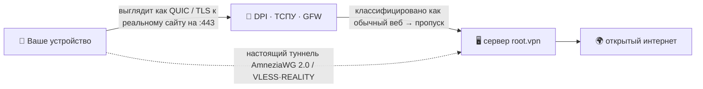

<div align="center">

# 🛡️ root.vpn

### VPN одной командой, которого не видит цензура.

**AmneziaWG 2.0 + VLESS·REALITY на одном порту, развёртывание в одну строку — заранее настроено так, чтобы выглядеть обычным интернетом для российского ТСПУ, китайского GFW и иранского фильтрнета.**


<br>


**🌐 [English](README.md) · Русский · [中文](README.zh.md) · [Tiếng Việt](README.vi.md)**

</div>

```bash
git clone https://github.com/antidetect/root.vpn && cd root.vpn && sudo ./awg2
```

Эта одна строка поднимает закалённый road‑warrior сервер с **двумя входами на порту 443** и печатает QR для подключения. Никаких флагов. Никакой веб‑панели. Никаких дашбордов, которые палятся.

> [!WARNING]
> **Сначала честно:** AmneziaWG работает только по UDP. Где сеть режет *весь* UDP, root.vpn автоматически выдаёт каждому клиенту **второй профиль TCP/443 (VLESS + REALITY)** — и связь всё равно проходит. Две двери, одна команда.

---

## ✨ Почему root.vpn

- 🥷 **Невидимый, а не просто шифрованный.** Голые WireGuard/OpenVPN тривиально фингерпринтятся и мертвы в РФ/КН/ИР. root.vpn маскирует *первый пакет* под настоящий **QUIC‑хендшейк к легитимному сайту**, а TCP‑фолбэк **заимствует TLS реального сайта** (REALITY) — активный пробер видит просто этот реальный сайт.
- 🎲 **Уникален на каждом сервере.** Мусорные пакеты, паддинг сообщений, ranged‑заголовки и QUIC‑сигнатура **рандомизированы на каждый деплой** — универсальной сигнатуры для блокировки нет. Две установки не похожи друг на друга.
- 🚪 **UDP *и* TCP на :443.** Быстрый AmneziaWG/UDP по умолчанию; VLESS+REALITY/TCP — фолбэк для сетей с заблокированным UDP или жёстким DPI. На одном хосте, без конфликтов.
- ⚡ **Одна команда — сервер делает всё.** Ставит модуль ядра, генерит ключи, собирает конфиги, открывает фаервол, настраивает NAT, создаёт первого клиента и печатает QR.
- 🔒 **Закалён по умолчанию.** Full‑tunnel (без утечек), секреты `0600` от имени сервис‑юзера, **без access‑логов**, песочница systemd, UFW + fail2ban.
- 🧾 **Ваш, MIT, аудируемый.** Тонкий читаемый оверлей над проверенными [`bivlked/amneziawg-installer`](https://github.com/bivlked/amneziawg-installer) + [Xray‑core](https://github.com/XTLS/Xray-core).

## ✅ Проверено на живом сервере

Это не игрушка, проверенная только синтаксисом. Каждый путь прогнан end‑to‑end на свежем **Ubuntu 24.04**:

| Тест | Результат |
|---|---|
| AmneziaWG 2.0 (UDP/443): реальный хендшейк клиента + трафик | **egress IP = сервер ✓** |
| VLESS + REALITY + Vision (TCP/443): реальный клиент через SOCKS | **egress IP = сервер ✓** |
| Утечки IPv4 / **IPv6** / **DNS** | **нет утечек ✓** |
| Фаервол: UFW `deny routed`, FORWARD `DROP`+`awg0 ACCEPT`, NAT MASQUERADE | **✓** |
| fail2ban (брутфорс SSH) | **активен, банит ✓** |
| Жизненный цикл клиента: add / remove / list / `rotate-reality` | **✓** |
| Идемпотентный перезапуск через ребуты инсталлера | **✓** |

> Боевая обкатка вскрыла и починила ~10 реальных багов (обработка многоребутности, нехватка зависимостей, выбор REALITY‑decoy, владелец файлов для сервис‑юзера и др.) — такое находит только реальное развёртывание.

## 🧬 Как он остаётся невидимым

Самый первый пакет клиента — **обманка**: настоящий, уникальный на деплой **QUIC v1 Initial** с TLS ClientHello и *вашим* SNI (собран оффлайн по RFC 9000/9001, проверен стеком `aioquic`). Для цензора сессия открывается как обычный HTTP/3 на 443; затем идёт настоящий хендшейк AmneziaWG (junk + паддинг + ranged‑заголовки), а сервер молча игнорирует обманку. TCP‑фолбэк использует **REALITY** — реле́ит TLS‑хендшейк настоящего стороннего сайта, поэтому зондирование вашего сервера возвращает просто этот реальный сайт.



## ⚔️ Сравнение

| | Голый WireGuard | Сток OpenVPN | Обычный AmneziaWG | **root.vpn** |
|---|:---:|:---:|:---:|:---:|
| Выживает против DPI РФ/КН/ИР | ❌ | ❌ | ⚠️ | ✅ |
| Мимикрия протокола (QUIC/REALITY) | ❌ | ❌ | ⚠️ частично | ✅ |
| Устойчив к активному зондированию | ❌ | ❌ | ⚠️ | ✅ (REALITY) |
| TCP/443 фолбэк для сетей без UDP | ❌ | ⚠️ | ❌ | ✅ |
| Уникальная сигнатура на деплой | ❌ | ❌ | ⚠️ | ✅ |
| Одна команда, без панели | ⚠️ | ⚠️ | ⚠️ | ✅ |
| Full‑tunnel с проверкой на утечки | ⚠️ | ⚠️ | ⚠️ | ✅ |

## 🚀 Установка за ~60 секунд

**Нужно:** свежий VPS **Ubuntu 24.04 / Debian 12** (идеально 1 ГБ RAM; скрипт добавит swap при нехватке) на **IP с чистой репутацией** (избегайте «сожжённых» VPS‑подсетей), и root.

```bash
# 1) забрать
git clone https://github.com/antidetect/root.vpn
cd root.vpn

# 2) (рекомендуется) задать низкопрофильный REALITY-decoy в defaults.conf
#    nano defaults.conf  ->  REALITY_DEST="dl.google.com"   (или пусто — авто-выбор)
#    и QUIC SNI:             AWG_SNI="www.cloudflare.com"

# 3) запуск (это вся установка)
sudo ./awg2
```

На свежем образе нижележащий инсталлер один‑два раза перезагружается, чтобы загрузить новое ядро — **просто запустите `sudo ./awg2` снова после каждого ребута**, он безопасно продолжит. По завершении увидите `all checks passed`, **два QR** первого клиента и ссылку `vless://`.

> Полная инструкция для клиента — какое приложение на каждой платформе и как именно импортировать — в **[docs/USAGE.ru.md](docs/USAGE.ru.md)**.

## 🎛️ Управление

```bash
sudo awg2 add laptop                  # новый клиент на ОБЕИХ ногах → два QR + ссылка vless://
sudo awg2 add guest --expires=7d      # самоистекающий клиент
sudo awg2 remove laptop               # отозвать везде
sudo awg2 list                        # все клиенты, обе ноги
sudo awg2 status                      # интерфейсы, порты, сводка обфускации
sudo awg2 rotate-sni <домен>          # новый QUIC SNI + регенерация клиентов
sudo awg2 rotate-reality              # новый ключ REALITY + пере-экспорт ссылок
sudo awg2 rotate-reality-target <хост># сменить REALITY-decoy
sudo awg2 uninstall
```

## 📲 Подключение устройств

Каждому клиенту выдаются **два профиля** — сначала пробуйте AmneziaWG; VLESS — когда UDP заблокирован.

| Платформа | AmneziaWG (UDP) | VLESS·REALITY (TCP) |
|---|---|---|
| Windows | AmneziaVPN | v2rayN / Hiddify |
| macOS | AmneziaVPN | Hiddify / Streisand / FoXray |
| Android | AmneziaWG / AmneziaVPN | Hiddify / v2rayNG |
| iOS | AmneziaVPN | FoXray (бесплатно) / Streisand |
| Linux | `awg-quick` / AmneziaVPN | Hiddify / NekoRay / mihomo |

👉 **Пошаговый импорт + траблшутинг + проверка утечек:** [docs/USAGE.ru.md](docs/USAGE.ru.md) · [English](docs/USAGE.md)

## 🎚️ Уровни маскировки

| Уровень | Стек | Для чего |
|---|---|---|
| **Good** (по умолч.) | AWG/UDP + VLESS‑REALITY‑**Vision** TCP/443 | под Китай, скорость, мало юзеров |
| **Better** | TCP‑нога через **XHTTP + mux** (`TCP_TRANSPORT="xhttp"`) | Россия (переживает блок Vision ТСПУ ноя‑2025) |
| **Max** | + CDN‑фронт XHTTP+TLS, постквантовое VLESS‑шифрование | Иран (вайтлисты), враждебные ASN |

Детали и инженерное обоснование: **[docs/DESIGN‑v2‑tcp‑masking.md](docs/DESIGN-v2-tcp-masking.md)**.

## 🛡️ Закалён по умолчанию

Full‑tunnel · UFW (`deny routed`) + fail2ban · `net.ipv6.disable_ipv6=1` (нет v6‑утечки) · NAT MASQUERADE + `FORWARD DROP` · приватный ключ REALITY и секреты клиентов `0600` от имени сервис‑юзера · **access‑лог Xray выключен** (нет IP/SNI клиента на диске) · песочница systemd (`NoNewPrivileges`, `ProtectSystem=strict`, только `CAP_NET_BIND_SERVICE`) · запиненные апстримы · рандомизированная на деплой обфускация.

## ⚠️ Честные ограничения

- **Репутация IP/ASN важнее любого протокола.** На «сожжённых» VPS‑диапазонах хендшейк проходит, а данные умирают — берите чистый/резидентный exit.
- **Выбор REALITY‑decoy важен.** Используйте чистый TLS1.3+HTTP/2 сайт (`dl.google.com`, `www.lovelive-anime.jp`); **избегайте** сайтов с гигантской цепочкой сертификатов (`microsoft.com`, `amazon.com`) — они ломают REALITY‑хендшейк. root.vpn идёт с проверенным списком и валидирует ваш выбор.
- **Привязка к клиенту.** AWG 2.0 понимает приложение Amnezia; TCP‑ногу — приложения семейства Xray. Единый клиент с авто‑фолбэком (Mihomo) — в планах.
- **Доверие.** Запускает запиненный апстрим‑код от root — прочитайте его, при желании запиньте `UPSTREAM_SHA256`.

## 📚 Документация

- 📖 [Инструкция для клиента](docs/USAGE.ru.md) ([EN](docs/USAGE.md)) — подключить любое устройство
- 🏗️ [Дизайн v2](docs/DESIGN-v2-tcp-masking.md) — архитектура, карта угроз, уровни

## 🙏 Благодарности и лицензия

Построено на [`bivlked/amneziawg-installer`](https://github.com/bivlked/amneziawg-installer) и [amnezia‑vpn](https://github.com/amnezia-vpn) (AmneziaWG 2.0) + [XTLS/Xray‑core](https://github.com/XTLS/Xray-core) (VLESS·REALITY). Оффлайн‑генератор QUIC‑Initial следует RFC 9000/9001 и является оригинальной работой. См. [NOTICE](NOTICE).

**MIT** © 2026 — см. [LICENSE](LICENSE). Для законного использования в целях приватности и обхода цензуры; вы сами отвечаете за соблюдение применимых к вам законов.
