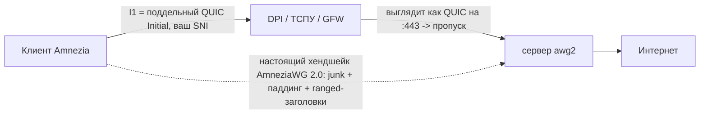

<div align="center">

# 🛡️ root.vpn &nbsp;·&nbsp; `awg2`

### Одна команда на чистом VPS → road‑warrior сервер **AmneziaWG 2.0**, заранее закалённый против *серьёзного* DPI.


**🌐 [English](README.md) · Русский · [中文](README.zh.md) · [Tiếng Việt](README.vi.md)**

</div>

> [!WARNING]
> **AmneziaWG работает только по UDP.** Он мимикрирует под QUIC/DNS/SIP, но не имеет TCP‑транспорта. В сетях, где режут *весь* UDP — или пускают только TCP‑443 к CDN — он **не подключится**. Держите запасной **OpenVPN+Cloak** или **VLESS+REALITY** (TCP/443) на той же машине. См. [Честные ограничения](#️-честные-ограничения).

---

## ✨ Зачем это

`awg2` — это тонкий, «с характером» **оверлей** поверх отличного [`bivlked/amneziawg-installer`](https://github.com/bivlked/amneziawg-installer) (MIT). Тот инсталлер делает всю тяжёлую работу — сборку DKMS, рандомизацию `Jc/Jmin/Jmax/S1–S4/H1–H4` на каждый деплой, генерацию клиентов/QR, пресеты под российских операторов. `awg2` добавляет сверху три вещи:

1. **Закалён по умолчанию** — никаких флагов помнить не нужно. Full‑tunnel + UDP/443 уже зашиты.
2. **Настоящая QUIC‑мимикрия, оффлайн.** Upstream отправляет генерацию `I1` в браузерный инструмент; все копируют один и тот же блоб с `SNI=7‑zip.org`, что *убивает* весь смысл AmneziaWG 2.0 (уникальность на каждый деплой). `awg2` локально генерирует **свежий, валидный, уникальный QUIC v1 Initial с вашим SNI** — каждый раз.
3. **Версия запинена.** Upstream меняется ежедневно; `awg2` фиксирует версию, поэтому ваша закалка не «протухает». Обновление — это одна переменная.

## 🎯 Что зашито в «закалку»

| Параметр | Дефолт | Зачем |
|---|---|---|
| 🧅 Туннель | **full** (`--route-all`) | ничего не утекает мимо туннеля |
| 🔌 Порт | **UDP/443** | сливается с QUIC / HTTP‑3 |
| 🎭 Мимикрия `I1` | **настоящий QUIC Initial + ваш SNI** | бьёт и DPI, который *классифицирует* QUIC, и DPI, который *расшифровывает Initial и читает SNI* (напр. GFW) |
| 🎲 `Jc/Jmin/Jmax/S1–S4/H1–H4` | рандом **на каждый деплой** | нет универсальной сигнатуры; непересекающиеся диапазоны `H` ≤ INT32_MAX |

## 🧬 Как работает QUIC‑мимикрия

Первое, что отправляет клиент, — это `I1`, **пакет‑обманка**. `awg2` делает его настоящим QUIC Initial с TLS ClientHello, содержащим *ваш* SNI. Для цензора сессия открывается как обычный HTTP/3 на порт 443; затем идёт настоящий хендшейк AmneziaWG (мусорные пакеты, паддинг каждого сообщения, ranged‑заголовки), а сервер молча игнорирует обманку.



## 🚀 Быстрый старт

```bash
git clone https://github.com/antidetect/root.vpn
cd root.vpn

# Задайте единственный тумблер: низкопрофильный SNI для QUIC-мимикрии (см. defaults.conf)
#   nano defaults.conf   ->   AWG_SNI="static.licdn.com"

sudo ./awg2
```

Это установит AmneziaWG 2.0, применит закалённый профиль, создаст первого клиента `phone` и напечатает его QR. Импортируйте его в **клиент Amnezia ≥ 4.8.12.9** (только он сейчас понимает AWG 2.0).

> Пустой `AWG_SNI` тоже работает — будет *shape‑only* QUIC‑мимикрия (выглядит как QUIC, без вшитого SNI). Против серьёзного DPI задайте реальный SNI.

## 🔑 Единственный тумблер — ваш SNI

Вшитый SNI — единственное, что нужно выбрать. Берите **низкопрофильный** домен, правдоподобный для региона вашего exit‑узла, и **разный на каждый деплой**.

| | Домен |
|---|---|
| ✅ **Можно** | тихий CDN / финансовый / гос / корпоративный хост (напр. `www.gov.uk`, `static.licdn.com`, небольшой SaaS‑домен) |
| ❌ **Нельзя** | `youtube.com`, `*.cloudflare.com`, Discord, CDN Telegram, `*.googlevideo.com`, STUN‑хосты — заблокированы или пересекаются с инфраструктурой |

Это «движущаяся мишень». Если маршрут деградировал: `sudo awg2 rotate-sni new.example.com`.

## 🎛️ Команды

| Команда | Действие |
|---|---|
| `sudo ./awg2` | закалённая установка (читает `defaults.conf`) |
| `sudo awg2 add <имя> [--expires=7d] [--psk]` | новый клиент + QR |
| `sudo awg2 remove <имя>` | отозвать клиента |
| `sudo awg2 list -v` | список клиентов |
| `sudo awg2 status` | состояние интерфейса + сводка обфускации |
| `sudo awg2 rotate-sni <домен>` | новый QUIC SNI, переприменить, регенерировать клиентов |
| `sudo awg2 rotate-i1` | свежий QUIC Initial (тот же SNI) |
| `sudo awg2 uninstall` | удалить всё |

> После `rotate-sni` / `rotate-i1` **раздайте заново** обновлённые конфиги из `/root/awg/` — `I1` обязан быть байт‑в‑байт одинаковым на сервере и каждом клиенте. `awg2` считает рассинхрон фатальной ошибкой, поэтому он никогда не отгружается молча.

## 🧱 Закалённые дефолты (`defaults.conf`)

```ini
AWG_SNI=""              # ← задайте. низкопрофильный SNI для QUIC-мимикрии
AWG_PORT="443"          # UDP/443 (сливается с QUIC/HTTP-3)
AWG_TUNNEL="full"       # full = весь трафик | amnezia = split-tunnel
AWG_MIMICRY="quic"      # quic = настоящий Initial+SNI | shape = только похоже на QUIC | off
AWG_PRESET=""           # "" | "mobile" (соты РФ/Ирана с DPI)
AWG_FIRST_CLIENT="phone"
UPSTREAM_VERSION="v5.18.1"   # запиненный upstream-инсталлер
```

## ✅ Проверено, а не на словах

Оффлайн‑генератор QUIC [`lib/quic_i1.py`](lib/quic_i1.py) проверен тремя независимыми способами:

- 🧾 **Тест‑векторы RFC 9001 Приложение A.1** — вывод ключей key/iv/hp для Initial совпадает со спецификацией байт‑в‑байт.
- 🔁 **Round‑trip self‑test** — собирает пакет, снимает header protection, расшифровывает AEAD, парсит ClientHello, сверяет SNI.
- 🦺 **Независимый парсер (`aioquic`)** — отдельный зрелый QUIC‑стек достаёт из нашего пакета SNI, ALPN `h3` и cipher suites.

```bash
python3 lib/quic_i1.py --selftest          # собрать → расшифровать → сверить SNI
python3 lib/quic_i1.py --sni www.gov.uk    # печатает токен I1 = <b 0x...>
```

Каждый запуск даёт **уникальный** пакет (случайные connection ID/ключи, GREASE, перемешанные TLS‑расширения), так что два деплоя не делят один отпечаток.

## ⚠️ Честные ограничения

> [!CAUTION]
> Прочитайте это, прежде чем полагаться на инструмент против цензора государственного уровня.

- **Только UDP** — см. предупреждение вверху. Держите TCP‑запас (OpenVPN+Cloak / VLESS+REALITY).
- **Репутация IP/ASN решает.** На известных VPS‑диапазонах (напр. Hetzner AS24940 из РФ) хендшейк проходит, а данные затем умирают — это AS‑level рез, а не проблема параметров. Берите чистый / резидентный exit.
- **SNI «протухает».** Безопасный SNI — движущаяся мишень → `rotate-sni`.
- **Привязка к клиенту.** На середину 2026 AWG 2.0 понимает только приложение Amnezia (Throne/Hiddify/sing‑box — пока нет).
- **Доверие.** `awg2` запускает запиненный upstream‑скрипт от root. Прочтите его (`less /root/awg-hardened/install_amneziawg_en.sh`) и при желании запиньте `UPSTREAM_SHA256` в `defaults.conf`.

## 📁 Структура

```
awg2              закалённый entrypoint (установка + прокси управления + ротация)
defaults.conf     дефолты, которые правят один раз (главный — AWG_SNI)
lib/quic_i1.py    оффлайн-генератор QUIC v1 Initial + SNI (RFC 9000/9001)
NOTICE / LICENSE  MIT; атрибуция bivlked/amneziawg-installer и amnezia-vpn
```

## 🙏 Благодарности и лицензия

Построено на [`bivlked/amneziawg-installer`](https://github.com/bivlked/amneziawg-installer) и проекте [amnezia‑vpn](https://github.com/amnezia-vpn) — им вся заслуга за инсталлер и протокол AmneziaWG 2.0. Генератор QUIC Initial следует RFC 9000 / RFC 9001 и является оригинальной работой. См. [NOTICE](NOTICE).

**MIT** © 2026 — см. [LICENSE](LICENSE). Для законного использования в целях приватности / обхода цензуры; вы сами отвечаете за соблюдение применимых к вам законов.
