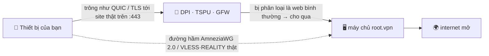

<div align="center">

# 🛡️ root.vpn

### VPN một dòng lệnh mà kiểm duyệt không nhìn thấy.

**AmneziaWG 2.0 + VLESS·REALITY trên cùng một cổng, triển khai trong một dòng — tinh chỉnh sẵn để trông như lưu lượng internet bình thường trước TSPU của Nga, GFW của Trung Quốc và filternet của Iran.**


<br>


**🌐 [English](README.md) · [Русский](README.ru.md) · [中文](README.zh.md) · Tiếng Việt**

</div>

```bash
git clone https://github.com/antidetect/root.vpn && cd root.vpn && sudo ./awg2
```

Chỉ một dòng đó dựng nên một máy chủ road‑warrior đã được gia cố với **hai lối vào trên cổng 443** và in mã QR để bạn quét và kết nối. Không cờ tham số. Không bảng web. Không dashboard nào để lộ.

> [!WARNING]
> **Nói thẳng trước:** AmneziaWG chỉ chạy UDP. Ở nơi mạng chặn *toàn bộ* UDP, root.vpn tự động cấp cho mỗi client **hồ sơ thứ hai TCP/443 (VLESS + REALITY)** để vẫn vượt qua được. Hai cánh cửa, một câu lệnh.

---

## ✨ Vì sao chọn root.vpn

- 🥷 **Tàng hình, không chỉ mã hóa.** WireGuard/OpenVPN trần dễ bị lấy vân tay và đã “chết” ở RU/CN/IR. root.vpn ngụy trang *gói tin mở màn* thành một **bắt tay QUIC tới một website hợp lệ**, còn lối TCP dự phòng **mượn TLS của một site thật** (REALITY) — kẻ dò chủ động chỉ thấy site thật đó.
- 🎲 **Độc nhất trên mỗi máy chủ.** Gói rác, đệm theo từng thông điệp, header dạng khoảng và chữ ký giả‑QUIC đều **ngẫu nhiên hóa theo từng lần triển khai** — không có dấu hiệu chung nào để chặn. Hai lần cài không giống nhau.
- 🚪 **UDP *và* TCP trên :443.** Mặc định AmneziaWG/UDP tốc độ cao; dự phòng VLESS+REALITY/TCP cho mạng chặn UDP hoặc DPI gắt — chung một máy, không xung đột.
- ⚡ **Một lệnh, máy chủ lo hết.** Cài module nhân, sinh khóa, dựng cấu hình, mở tường lửa, thiết lập NAT, tạo client đầu tiên và in mã QR.
- 🔒 **Gia cố sẵn.** Toàn tuyến (không rò rỉ), bí mật `0600` thuộc về user dịch vụ, **không log truy cập**, sandbox systemd, UFW + fail2ban.
- 🧾 **Của bạn, MIT, kiểm toán được.** Một lớp phủ mỏng, dễ đọc trên nền [`bivlked/amneziawg-installer`](https://github.com/bivlked/amneziawg-installer) + [Xray‑core](https://github.com/XTLS/Xray-core) đã được tin dùng.

## ✅ Đã kiểm chứng trên máy chủ thật

Đây không phải đồ chơi chỉ qua kiểm tra cú pháp. Mọi đường đi đều được chạy đầu‑cuối trên một VPS **Ubuntu 24.04** mới:

| Kiểm thử | Kết quả |
|---|---|
| AmneziaWG 2.0 (UDP/443): client thật bắt tay + lưu lượng | **IP ra = máy chủ ✓** |
| VLESS + REALITY + Vision (TCP/443): client thật qua SOCKS | **IP ra = máy chủ ✓** |
| Rò rỉ IPv4 / **IPv6** / **DNS** | **không rò rỉ ✓** |
| Tường lửa: UFW `deny routed`, FORWARD `DROP`+`awg0 ACCEPT`, NAT MASQUERADE | **✓** |
| fail2ban (dò mật khẩu SSH) | **đang hoạt động, đang chặn ✓** |
| Vòng đời client: add / remove / list / `rotate-reality` | **✓** |
| Chạy lại idempotent qua các lần khởi động lại của trình cài đặt | **✓** |

> Đợt chạy thực tế đã phát hiện và sửa ~10 lỗi đời thực (xử lý nhiều lần reboot, thiếu phụ thuộc, chọn site ngụy trang REALITY, quyền sở hữu file cho user dịch vụ, v.v.) — những thứ chỉ triển khai thật mới lộ ra.

## 🧬 Cách nó tàng hình

Gói tin đầu tiên của client là **mồi nhử**: một **QUIC v1 Initial** thật, duy nhất theo từng lần triển khai, mang một TLS ClientHello với *SNI của bạn* (dựng ngoại tuyến theo RFC 9000/9001 — đã đối chiếu với ngăn xếp `aioquic`). Với bộ kiểm duyệt, phiên mở ra như HTTP/3 bình thường trên 443; sau đó mới là bắt tay AmneziaWG thật (gói rác + đệm + header dạng khoảng), còn máy chủ lặng lẽ bỏ qua mồi nhử. Lối TCP dùng **REALITY** — chuyển tiếp bắt tay TLS của một site bên thứ ba thật, nên dò máy chủ của bạn chỉ trả về đúng site thật đó.



## ⚔️ So sánh

| | WireGuard trần | OpenVPN gốc | AmneziaWG thường | **root.vpn** |
|---|:---:|:---:|:---:|:---:|
| Sống sót trước DPI RU/CN/IR | ❌ | ❌ | ⚠️ | ✅ |
| Giả dạng giao thức (QUIC/REALITY) | ❌ | ❌ | ⚠️ một phần | ✅ |
| Kháng dò chủ động | ❌ | ❌ | ⚠️ | ✅ (REALITY) |
| Dự phòng TCP/443 cho mạng chặn UDP | ❌ | ⚠️ | ❌ | ✅ |
| Dấu hiệu độc nhất mỗi lần triển khai | ❌ | ❌ | ⚠️ | ✅ |
| Một lệnh, không bảng điều khiển | ⚠️ | ⚠️ | ⚠️ | ✅ |
| Toàn tuyến và đã test rò rỉ | ⚠️ | ⚠️ | ⚠️ | ✅ |

## 🚀 Cài trong ~60 giây

**Bạn cần:** một VPS **Ubuntu 24.04 / Debian 12** mới (lý tưởng 1 GB RAM; script tự thêm swap nếu thiếu) có **IP danh tiếng sạch** (tránh dải VPS đã bị chặn), và quyền root.

```bash
# 1) lấy về
git clone https://github.com/antidetect/root.vpn
cd root.vpn

# 2) (khuyến nghị) chọn một site ngụy trang REALITY kín đáo trong defaults.conf
#    nano defaults.conf  ->  REALITY_DEST="dl.google.com"   (để trống = tự chọn)
#    và QUIC SNI:            AWG_SNI="www.cloudflare.com"

# 3) chạy (đây là toàn bộ cài đặt)
sudo ./awg2
```

Trên image mới, trình cài đặt nền sẽ reboot một hai lần để nạp nhân mới — **chỉ cần chạy lại `sudo ./awg2` sau mỗi lần reboot**, nó tiếp tục an toàn. Khi xong bạn sẽ thấy `all checks passed`, **hai mã QR** của client đầu tiên và một liên kết `vless://`.

> Hướng dẫn client đầy đủ — dùng app nào trên từng nền tảng và nhập cấu hình ra sao — ở **[docs/USAGE.md](docs/USAGE.md)**.

## 🎛️ Quản lý

```bash
sudo awg2 add laptop                  # client mới trên CẢ HAI chân → hai QR + link vless://
sudo awg2 add guest --expires=7d      # client tự hết hạn
sudo awg2 remove laptop               # thu hồi mọi nơi
sudo awg2 list                        # mọi client, cả hai chân
sudo awg2 status                      # interface, cổng, tóm tắt ngụy trang
sudo awg2 rotate-sni <tên miền>       # SNI QUIC mới + tạo lại client
sudo awg2 rotate-reality              # khóa REALITY mới + xuất lại link
sudo awg2 rotate-reality-target <host># đổi site ngụy trang REALITY
sudo awg2 uninstall
```

## 📲 Kết nối thiết bị

Mỗi client nhận **hai hồ sơ** — thử AmneziaWG trước; dùng VLESS khi UDP bị chặn.

| Nền tảng | AmneziaWG (UDP) | VLESS·REALITY (TCP) |
|---|---|---|
| Windows | AmneziaVPN | v2rayN / Hiddify |
| macOS | AmneziaVPN | Hiddify / Streisand / FoXray |
| Android | AmneziaWG / AmneziaVPN | Hiddify / v2rayNG |
| iOS | AmneziaVPN | FoXray (miễn phí) / Streisand |
| Linux | `awg-quick` / AmneziaVPN | Hiddify / NekoRay / mihomo |

👉 **Nhập từng bước + xử lý sự cố + kiểm tra rò rỉ:** [docs/USAGE.md](docs/USAGE.md)

## 🎚️ Mức độ tàng hình

| Mức | Ngăn xếp | Hợp cho |
|---|---|---|
| **Good** (mặc định) | AWG/UDP + VLESS‑REALITY‑**Vision** TCP/443 | thiên Trung Quốc, tốc độ, ít người dùng |
| **Better** | Chân TCP qua **XHTTP + mux** (`TCP_TRANSPORT="xhttp"`) | Nga (sống sót đợt chặn Vision của TSPU 11‑2025) |
| **Max** | + XHTTP+TLS qua CDN, mã hóa VLESS hậu lượng tử | Iran whitelist, ASN thù địch |

Chi tiết và lý do kỹ thuật: **[docs/DESIGN‑v2‑tcp‑masking.md](docs/DESIGN-v2-tcp-masking.md)**.

## 🛡️ Gia cố mặc định

Toàn tuyến · UFW (`deny routed`) + fail2ban · `net.ipv6.disable_ipv6=1` (không rò rỉ v6) · NAT MASQUERADE + `FORWARD DROP` · khóa riêng REALITY và bí mật client `0600` thuộc user dịch vụ · **tắt log truy cập Xray** (không ghi IP/SNI client xuống đĩa) · sandbox systemd (`NoNewPrivileges`, `ProtectSystem=strict`, chỉ `CAP_NET_BIND_SERVICE`) · ghim phiên bản upstream · ngụy trang ngẫu nhiên theo từng lần triển khai.

## ⚠️ Giới hạn thành thật

- **Danh tiếng IP/ASN thắng mọi giao thức.** Trên dải VPS đã bị chặn, bắt tay xong là dữ liệu “chết” — hãy dùng nút thoát sạch/dân cư.
- **Chọn site ngụy trang REALITY rất quan trọng.** Dùng site TLS1.3+HTTP/2 sạch (`dl.google.com`, `www.lovelive-anime.jp`); **tránh** site có chuỗi chứng chỉ khổng lồ (`microsoft.com`, `amazon.com`) — sẽ làm hỏng bắt tay REALITY. root.vpn đi kèm danh sách đã kiểm và sẽ thẩm định lựa chọn của bạn.
- **Khóa client.** AWG 2.0 do app Amnezia hỗ trợ; chân TCP do các app dòng Xray. Một app tự động chuyển dự phòng (Mihomo) nằm trong lộ trình.
- **Tin cậy.** Nó chạy mã upstream đã ghim với quyền root — hãy đọc, ghim `UPSTREAM_SHA256` nếu muốn.

## 📚 Tài liệu

- 📖 [Hướng dẫn sử dụng client](docs/USAGE.md) — kết nối mọi thiết bị
- 🏗️ [Thiết kế v2](docs/DESIGN-v2-tcp-masking.md) — kiến trúc, ánh xạ mối đe dọa, các mức

## 🙏 Ghi công & Giấy phép

Xây trên [`bivlked/amneziawg-installer`](https://github.com/bivlked/amneziawg-installer) và [amnezia‑vpn](https://github.com/amnezia-vpn) (AmneziaWG 2.0) + [XTLS/Xray‑core](https://github.com/XTLS/Xray-core) (VLESS·REALITY). Trình tạo QUIC‑Initial ngoại tuyến tuân theo RFC 9000/9001 và là công trình gốc. Xem [NOTICE](NOTICE).

**MIT** © 2026 — xem [LICENSE](LICENSE). Dành cho mục đích riêng tư & vượt kiểm duyệt hợp pháp; bạn tự chịu trách nhiệm tuân thủ luật áp dụng cho mình.
