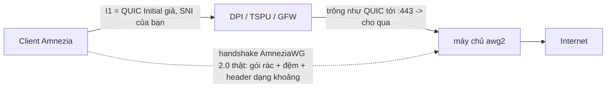

<div align="center">

# 🛡️ amneziawg-hardened &nbsp;·&nbsp; `awg2`

### Một lệnh trên VPS mới → máy chủ **AmneziaWG 2.0** kiểu road‑warrior, tinh chỉnh sẵn để vượt qua DPI *khắt khe*.


**🌐 [English](README.md) · [Русский](README.ru.md) · [中文](README.zh.md) · Tiếng Việt**

</div>

> [!WARNING]
> **AmneziaWG chỉ chạy UDP.** Nó giả dạng QUIC/DNS/SIP nhưng không có lớp truyền TCP. Trên mạng chặn *toàn bộ* UDP — hoặc chỉ cho TCP‑443 đến CDN — nó **không thể kết nối**. Hãy giữ một phương án dự phòng **OpenVPN+Cloak** hoặc **VLESS+REALITY** (TCP/443) trên cùng máy. Xem [Giới hạn thành thật](#️-giới-hạn-thành-thật).

---

## ✨ Vì sao có dự án này

`awg2` là một **lớp phủ** mỏng, có quan điểm rõ ràng, đặt trên trình cài đặt xuất sắc [`bivlked/amneziawg-installer`](https://github.com/bivlked/amneziawg-installer) (MIT). Trình đó lo phần nặng — biên dịch DKMS, ngẫu nhiên hóa `Jc/Jmin/Jmax/S1–S4/H1–H4` theo từng lần triển khai, tạo client/QR, preset cho nhà mạng Nga. `awg2` bổ sung ba điều bên trên:

1. **Mặc định đã được gia cố** — không cần nhớ cờ nào. Toàn tuyến (full‑tunnel) + UDP/443 đã được nhúng sẵn.
2. **Giả dạng QUIC thật, ngoại tuyến.** Thượng nguồn đẩy việc tạo `I1` cho công cụ trình duyệt; ai cũng sao chép cùng một khối `SNI=7‑zip.org`, điều đó *phá hỏng* toàn bộ ý nghĩa của AmneziaWG 2.0 (tính duy nhất theo từng lần triển khai). `awg2` tạo cục bộ **một QUIC v1 Initial mới, hợp lệ, duy nhất, mang chính SNI của bạn** — mỗi lần.
3. **Ghim phiên bản.** Thượng nguồn thay đổi hằng ngày; `awg2` ghim lại, nên phần gia cố của bạn không bị “mục”. Cập nhật chỉ là một biến.

## 🎯 “Gia cố” nhúng sẵn những gì

| Mục | Mặc định | Vì sao |
|---|---|---|
| 🧅 Đường hầm | **full** (`--route-all`) | không gì rò rỉ ngoài đường hầm |
| 🔌 Cổng | **UDP/443** | hòa lẫn với QUIC / HTTP‑3 |
| 🎭 Giả dạng `I1` | **QUIC Initial thật + SNI của bạn** | qua mặt cả DPI *phân loại* QUIC lẫn DPI *giải mã Initial và đọc SNI* (vd. GFW) |
| 🎲 `Jc/Jmin/Jmax/S1–S4/H1–H4` | ngẫu nhiên **theo từng lần triển khai** | không có chữ ký chung; các khoảng `H` không chồng lấn và ≤ INT32_MAX |

## 🧬 Cơ chế giả dạng QUIC

Thứ đầu tiên client gửi là `I1` — một **gói mồi**. `awg2` biến nó thành một QUIC Initial thật chứa TLS ClientHello mang *SNI của bạn*. Với bộ kiểm duyệt, phiên mở ra giống HTTP/3 thông thường tới cổng 443; sau đó mới là handshake AmneziaWG thật (gói rác, đệm theo từng thông điệp, header dạng khoảng) còn máy chủ lặng lẽ bỏ qua gói mồi.



## 🚀 Bắt đầu nhanh

```bash
git clone https://github.com/antidetect/amneziawg-hardened
cd amneziawg-hardened

# Đặt công tắc duy nhất: một SNI kín đáo cho phần giả dạng QUIC (xem defaults.conf)
#   nano defaults.conf   ->   AWG_SNI="static.licdn.com"

sudo ./awg2
```

Lệnh này cài AmneziaWG 2.0, áp dụng hồ sơ gia cố, tạo client đầu tiên `phone` và in mã QR. Hãy nhập bằng **client Amnezia ≥ 4.8.12.9** (hiện chỉ client này hiểu AWG 2.0).

> Để trống `AWG_SNI` vẫn chạy — sẽ lùi về giả dạng QUIC *chỉ hình dạng* (trông giống QUIC, không nhúng SNI). Với DPI khắt khe, hãy đặt SNI thật.

## 🔑 Công tắc duy nhất — SNI của bạn

SNI được nhúng là thứ duy nhất bạn phải chọn. Hãy chọn một tên miền **kín đáo**, hợp lý với khu vực của nút thoát, và **khác nhau cho mỗi lần triển khai**.

| | Tên miền |
|---|---|
| ✅ **Nên** | một host CDN / tài chính / chính phủ / doanh nghiệp kín đáo (vd. `www.gov.uk`, `static.licdn.com`, một tên miền SaaS nhỏ) |
| ❌ **Tránh** | `youtube.com`, `*.cloudflare.com`, Discord, CDN của Telegram, `*.googlevideo.com`, host STUN — đã bị chặn hoặc trùng hạ tầng |

Đây là mục tiêu luôn dịch chuyển. Nếu tuyến xuống cấp: `sudo awg2 rotate-sni new.example.com`.

## 🎛️ Lệnh

| Lệnh | Tác dụng |
|---|---|
| `sudo ./awg2` | cài đặt gia cố (đọc `defaults.conf`) |
| `sudo awg2 add <tên> [--expires=7d] [--psk]` | client mới + QR |
| `sudo awg2 remove <tên>` | thu hồi client |
| `sudo awg2 list -v` | liệt kê client |
| `sudo awg2 status` | tổng quan giao diện + tham số ngụy trang |
| `sudo awg2 rotate-sni <tên miền>` | SNI QUIC mới, áp dụng lại, tạo lại mọi client |
| `sudo awg2 rotate-i1` | QUIC Initial mới (giữ nguyên SNI) |
| `sudo awg2 uninstall` | gỡ tất cả |

> Sau `rotate-sni` / `rotate-i1`, hãy **phân phối lại** các cấu hình client cập nhật từ `/root/awg/` — `I1` phải giống nhau từng byte trên máy chủ và mọi client. `awg2` coi sự lệch nhau là lỗi nghiêm trọng, nên không bao giờ âm thầm phát hành.

## 🧱 Mặc định gia cố (`defaults.conf`)

```ini
AWG_SNI=""              # ← đặt giá trị này. SNI kín đáo cho giả dạng QUIC
AWG_PORT="443"          # UDP/443 (hòa với QUIC/HTTP-3)
AWG_TUNNEL="full"       # full = toàn bộ lưu lượng | amnezia = chia tuyến
AWG_MIMICRY="quic"      # quic = Initial+SNI thật | shape = chỉ giống QUIC | off
AWG_PRESET=""           # "" | "mobile" (DPI di động RU/Iran)
AWG_FIRST_CLIENT="phone"
UPSTREAM_VERSION="v5.18.1"   # trình cài đặt thượng nguồn đã ghim
```

## ✅ Đã kiểm chứng, không nói suông

Trình tạo QUIC ngoại tuyến [`lib/quic_i1.py`](lib/quic_i1.py) được kiểm chứng theo ba cách độc lập:

- 🧾 **Vector kiểm thử RFC 9001 Phụ lục A.1** — việc dẫn xuất key/iv/hp cho Initial khớp đặc tả từng byte.
- 🔁 **Tự kiểm khứ hồi** — dựng gói, gỡ bảo vệ header, giải mã AEAD, phân tích ClientHello, kiểm chứng SNI.
- 🦺 **Bộ phân tích độc lập (`aioquic`)** — một ngăn xếp QUIC trưởng thành khác khôi phục được SNI, ALPN `h3` và các bộ mã từ gói của ta.

```bash
python3 lib/quic_i1.py --selftest          # dựng → giải mã → kiểm SNI khứ hồi
python3 lib/quic_i1.py --sni www.gov.uk    # in token I1 = <b 0x...>
```

Mỗi lần chạy tạo ra một gói **duy nhất** (connection ID/khóa ngẫu nhiên, GREASE, xáo trộn phần mở rộng TLS), nên không hai lần triển khai nào trùng dấu vân tay.

## ⚠️ Giới hạn thành thật

> [!CAUTION]
> Hãy đọc kỹ trước khi dựa vào nó để chống lại bộ kiểm duyệt cấp nhà nước.

- **Chỉ UDP** — xem cảnh báo ở đầu. Hãy giữ phương án TCP (OpenVPN+Cloak / VLESS+REALITY).
- **Uy tín IP/ASN là yếu tố quyết định.** Trên các dải VPS nổi tiếng (vd. Hetzner AS24940 từ Nga) handshake có thể hoàn tất rồi dữ liệu “chết” — đó là cắt ở mức AS, không phải lỗi tham số. Hãy dùng nút thoát sạch / uy tín dân cư.
- **SNI bị “mục”.** SNI an toàn là mục tiêu di động → `rotate-sni`.
- **Khóa vào client.** Tính đến giữa 2026, chỉ ứng dụng Amnezia hiểu AWG 2.0 (Throne/Hiddify/sing‑box thì chưa).
- **Tin cậy.** `awg2` chạy một script thượng nguồn đã ghim với quyền root. Hãy đọc nó (`less /root/awg-hardened/install_amneziawg_en.sh`) và có thể ghim `UPSTREAM_SHA256` trong `defaults.conf`.

## 📁 Bố cục

```
awg2              điểm vào gia cố (cài đặt + proxy quản lý + xoay vòng)
defaults.conf     mặc định chỉnh một lần (chính là AWG_SNI)
lib/quic_i1.py    trình tạo QUIC v1 Initial + SNI ngoại tuyến (RFC 9000/9001)
NOTICE / LICENSE  MIT; ghi công bivlked/amneziawg-installer & amnezia-vpn
```

## 🙏 Ghi công & Giấy phép

Xây trên [`bivlked/amneziawg-installer`](https://github.com/bivlked/amneziawg-installer) và dự án [amnezia‑vpn](https://github.com/amnezia-vpn) — mọi công lao về trình cài đặt và giao thức AmneziaWG 2.0 thuộc về họ. Trình tạo QUIC Initial tuân theo RFC 9000 / RFC 9001 và là công trình gốc. Xem [NOTICE](NOTICE).

**MIT** © 2026 — xem [LICENSE](LICENSE). Dành cho mục đích riêng tư / vượt kiểm duyệt hợp pháp; bạn tự chịu trách nhiệm tuân thủ luật áp dụng cho mình.
