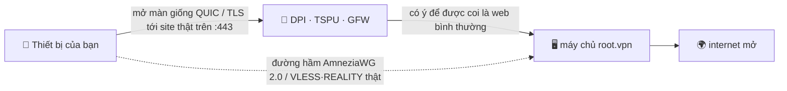

<div align="center">

# 🛡️ root.vpn

### VPN một dòng lệnh, làm ra để “hòa vào nền” ở nơi WireGuard trần bị chặn.

**AmneziaWG 2.0 (UDP/443) + VLESS·REALITY (TCP/443) chỉ bằng một lệnh — với ngụy trang giao thức được thiết kế để trông như lưu lượng QUIC/TLS bình thường và nhắm vào các kỹ thuật DPI dùng ở Nga, Trung Quốc và Iran.**


<br>

-16a34a?style=for-the-badge)


**🌐 [English](README.md) · [Русский](README.ru.md) · [中文](README.zh.md) · Tiếng Việt**

</div>

> [!IMPORTANT]
> **Nói thẳng:** root.vpn được **thiết kế** để trông như internet bình thường, và đã được **kiểm thử đầu‑cuối trên máy chủ thật** (xem bên dưới). Nó **chưa** được kiểm thử trước kiểm duyệt thực tế ở Nga/Trung/Iran — khả năng chống DPI là *thuộc tính thiết kế*, không phải kết quả đã chứng minh trên thực địa. Xem [Giới hạn thành thật](#️-giới-hạn-thành-thật). Không “dầu rắn”.

## Cài đặt (không cần git)

```bash
curl -fsSL https://raw.githubusercontent.com/antidetect/root.vpn/main/install.sh | sudo bash
```

Dòng đó dùng `curl`+`tar` (không cần git) tải root.vpn, dựng một máy chủ road‑warrior đã gia cố trên **cổng 443**, và in mã QR để bạn quét kết nối. Không cờ, không bảng web, không dashboard để lộ. Trên image mới, trình cài đặt nền reboot một hai lần để nạp nhân mới — **chỉ cần chạy lại cùng lệnh sau mỗi lần reboot**, nó tiếp tục an toàn.

Mặc định bạn có **hai lối vào trên :443**: **AmneziaWG/UDP** tốc độ cao *và* dự phòng **VLESS·REALITY/TCP** cho mạng chặn UDP (`TCP_ENABLED=1` là mặc định; đặt `0` để chỉ AWG).

> [!WARNING]
> AmneziaWG chỉ UDP. Nơi mạng chặn *toàn bộ* UDP, client dùng **hồ sơ thứ hai (VLESS + REALITY trên TCP/443)** để vượt qua. Hai cánh cửa, một câu lệnh.

---

## ✨ Vì sao chọn root.vpn

- 🥷 **Sinh ra để hòa lẫn, không chỉ mã hóa.** WireGuard/OpenVPN trần dễ bị lấy vân tay và bị chặn rộng ở RU/CN/IR. root.vpn ngụy trang *gói mở màn* thành một **QUIC client Initial tới một website hợp lệ**, còn chân TCP dùng **REALITY** chuyển tiếp bắt tay TLS của một site bên thứ ba thật — kẻ dò chủ động chỉ nhận lại đúng site thật đó.
- 🎲 **Không hai lần cài nào giống nhau.** Gói rác, đệm theo thông điệp, header dạng khoảng và phần mở màn giả‑QUIC đều **ngẫu nhiên theo từng lần triển khai** (connection ID, TLS random, key share, GREASE, thứ tự extension đều khác). Điều này loại bỏ dấu hiệu byte tĩnh chung giữa các máy chủ — nhưng **không** tuyên bố đánh bại bộ phân loại ML/mẫu‑kết‑nối.
- 🚪 **UDP *và* TCP trên :443.** Chung máy, không xung đột — đã xác nhận cả hai đang lắng nghe trên máy thật.
- ⚡ **Một lệnh, máy chủ lo phần còn lại.** Cài module nhân, sinh khóa, dựng cấu hình, mở tường lửa, thiết lập NAT, tạo client đầu tiên và in QR. (Cần root + HTTPS ra ngoài; có thể reboot/tiếp tục trên nhân mới.)
- 🔒 **Gia cố mặc định.** Toàn tuyến (không rò rỉ trong thử nghiệm có kiểm soát), UFW + fail2ban (từ upstream), và trên chân TCP là **Xray trong sandbox systemd** với bí mật `0600` thuộc user dịch vụ và **tắt log truy cập**.
- 🧾 **Của bạn, MIT, kiểm toán được.** Một lớp phủ mỏng, dễ đọc trên [`bivlked/amneziawg-installer`](https://github.com/bivlked/amneziawg-installer) + [Xray‑core](https://github.com/XTLS/Xray-core).

## ✅ Đã kiểm thử đầu‑cuối trên máy chủ thật

Không chỉ `bash -n`. Mọi đường đi đều chạy trên một VPS **Ubuntu 24.04** mới (Debian 12 được trình cài đặt hỗ trợ nhưng không nằm trong đợt chạy này):

| Kiểm thử | Kết quả |
|---|---|
| AmneziaWG 2.0 (UDP/443): client thật bắt tay + lưu lượng qua đường hầm | **IP ra = máy chủ ✓** |
| VLESS + REALITY + Vision (TCP/443): client thật qua SOCKS *(với site ngụy trang REALITY phù hợp)* | **IP ra = máy chủ ✓** |
| Rò rỉ IPv4 / **IPv6** / **DNS** — *trong E2E network‑namespace một máy (lab), không phải mạng client thật* | **không rò rỉ ✓** |
| Tường lửa: UFW `deny routed`, FORWARD `DROP`+`awg0 ACCEPT`, NAT MASQUERADE | **✓** |
| fail2ban (dò mật khẩu SSH) | **đang chạy, đang chặn ✓** |
| Vòng đời client: add / remove / list / `rotate-reality`; đường cài qua curl | **✓** |
| Chạy lại idempotent qua các lần reboot của trình cài đặt | **✓** |

> Đợt chạy này phát hiện và sửa ~10 lỗi triển khai đời thực (xử lý nhiều reboot, thiếu phụ thuộc, chọn site ngụy trang REALITY, quyền sở hữu file cho user dịch vụ, v.v.) — chỉ chạy thật mới lộ.

## 🧬 Cách nó hòa vào nền

*Gói mở màn* của client là **mồi nhử**: một **QUIC v1 Initial** thật, duy nhất theo từng lần triển khai, mang TLS ClientHello với *SNI của bạn* (dựng ngoại tuyến theo RFC 9000/9001; khóa Initial khớp vector kiểm thử RFC 9001 Phụ lục A.1, và trong quá trình phát triển gói được ngăn xếp độc lập `aioquic` phân tích — lấy lại được SNI). Với bộ kiểm duyệt, phiên *bắt đầu* như HTTP/3 thường trên 443; sau đó là bắt tay AmneziaWG thật, máy chủ bỏ qua mồi nhử. **Lưu ý:** chỉ gói đầu giả QUIC — một bộ phân loại có trạng thái theo dõi cả luồng vẫn có thể nhận ra nó không phải phiên HTTP/3 đầy đủ. Chân TCP dùng **REALITY**, dò sẽ nhận về một site bên thứ ba thật.



## ⚔️ So sánh tính năng thiết kế

*So sánh tính năng thiết kế sẵn có, không phải kết quả thực địa. Việc vượt kiểm duyệt thực tế chưa được kiểm chứng độc lập cho bất kỳ lựa chọn nào.*

| Tính năng | WireGuard trần | OpenVPN (TLS/443) | AmneziaWG gốc | **root.vpn** |
|---|:---:|:---:|:---:|:---:|
| Giả dạng / ngụy trang giao thức | ❌ | ⚠️ qua plugin | ✅ | ✅ |
| Chân TLS kháng dò chủ động | ❌ | ⚠️ tls‑crypt | ❌ | ✅ REALITY (chân TCP) |
| UDP **và** TCP trên :443 | ❌ | chỉ TCP | chỉ UDP | ✅ cả hai |
| Dấu hiệu ngẫu nhiên theo từng lần triển khai | ❌ | ❌ | ⚠️ thủ công | ✅ |
| Một lệnh + client + QR | ⚠️ | ⚠️ | ⚠️ | ✅ |
| Toàn tuyến, đã kiểm rò rỉ (lab E2E) | — | — | — | ✅ |

## 🚀 Cài đặt đầy đủ

**Bạn cần:** một VPS **Ubuntu 24.04** (hoặc Debian 12) mới — lý tưởng 1 GB RAM, script tự thêm swap nếu thiếu — có **IP danh tiếng sạch** (tránh dải VPS đã bị chặn), và quyền root.

**Nhanh nhất (không cần git):**
```bash
# có thể truyền cấu hình qua biến môi trường (site ngụy trang REALITY kín đáo + QUIC SNI):
curl -fsSL https://raw.githubusercontent.com/antidetect/root.vpn/main/install.sh \
  | sudo REALITY_DEST=dl.google.com AWG_SNI=www.cloudflare.com bash
```

**Hoặc tải về + sửa rồi chạy (cũng không cần git):**
```bash
curl -fsSL https://github.com/antidetect/root.vpn/archive/refs/heads/main.tar.gz | tar -xz
cd root.vpn-main
nano defaults.conf          # đặt REALITY_DEST / AWG_SNI, v.v.
sudo ./awg2
```

**Hoặc dùng git:**
```bash
git clone https://github.com/antidetect/root.vpn && cd root.vpn && sudo ./awg2
```

Khi xong bạn sẽ thấy `all checks passed`, mã QR của client đầu tiên và một link `vless://`. Hướng dẫn từng thiết bị: **[docs/USAGE.md](docs/USAGE.md)**.

## 🎛️ Quản lý

```bash
sudo awg2 add laptop                  # client mới trên cả hai chân → QR + link vless://
sudo awg2 add guest --expires=7d      # client tự hết hạn
sudo awg2 remove laptop               # thu hồi mọi nơi
sudo awg2 list                        # mọi client, cả hai chân
sudo awg2 status                      # interface, cổng, tóm tắt ngụy trang
sudo awg2 rotate-sni <tên miền>       # SNI QUIC mới + tạo lại client
sudo awg2 rotate-reality              # khóa REALITY mới + xuất lại link
sudo awg2 rotate-reality-target <host># đổi site ngụy trang REALITY
sudo awg2 uninstall
```

## 📲 Kết nối thiết bị

Mỗi client nhận một **hồ sơ AmneziaWG** và (khi bật chân TCP) một **hồ sơ VLESS·REALITY** — thử AmneziaWG trước; dùng VLESS khi UDP bị chặn.

| Nền tảng | AmneziaWG (UDP) | VLESS·REALITY (TCP) |
|---|---|---|
| Windows | AmneziaVPN | v2rayN / Hiddify |
| macOS | AmneziaVPN | Hiddify / v2rayN |
| Android | AmneziaWG / AmneziaVPN | Hiddify / v2rayNG |
| iOS | AmneziaVPN | Streisand (miễn phí) / Shadowrocket (trả phí) / Hiddify |
| Linux | `awg-quick` / AmneziaVPN | Hiddify / mihomo / `xray` |

👉 **Nhập từng bước + xử lý sự cố + kiểm tra rò rỉ:** [docs/USAGE.md](docs/USAGE.md)

## 🎚️ Tùy chọn tàng hình

| Tùy chọn | Cách | Trạng thái |
|---|---|---|
| **Mặc định** | AWG/UDP + VLESS‑REALITY‑**Vision** TCP/443 | ✅ nền tảng đã kiểm thử |
| **Tăng cường cho Nga** | Chân TCP qua **XHTTP** (`TCP_TRANSPORT="xhttp"`) | giảm thiểu trước việc TSPU bị báo chặn Vision‑trên‑443; **chưa kiểm chứng trên TSPU thật** |
| **CDN front / hậu lượng tử** | XHTTP+TLS qua CDN · mã hóa VLESS (ML‑KEM) | **thử nghiệm / thủ công**, mặc định tắt, không thuộc nền tảng đã kiểm thử |

Lý do kỹ thuật + ánh xạ mối đe dọa: **[docs/DESIGN‑v2‑tcp‑masking.md](docs/DESIGN-v2-tcp-masking.md)**.

## 🛡️ Gia cố

Toàn tuyến · UFW (`deny routed`) + fail2ban (upstream) · `net.ipv6.disable_ipv6=1` (không rò rỉ v6) · NAT MASQUERADE + `FORWARD DROP`. Trên chân TCP/Xray: khóa riêng REALITY + cấu hình Xray `0600` chown cho user dịch vụ · **tắt log truy cập Xray** (log của nó không có IP/SNI client) · sandbox systemd (`NoNewPrivileges`, `ProtectSystem=strict`, chỉ `CAP_NET_BIND_SERVICE`). Upstream ghim theo phiên bản (tùy chọn `UPSTREAM_SHA256` để ghim theo hash, mặc định tắt). Tham số ngụy trang ngẫu nhiên theo từng lần triển khai.

## ⚠️ Giới hạn thành thật

- **Chưa kiểm thử trước kiểm duyệt thực tế.** Vượt TSPU Nga / GFW Trung / DPI Iran **chưa** được kiểm chứng — chống DPI ở đây là ý đồ thiết kế + kiểm thử lab/chức năng, không phải kết quả thực địa.
- **Kiểm tra rò rỉ chỉ ở lab.** Đạt trong E2E network‑namespace một máy, *không* trên thiết bị và mạng truy cập thật. Hãy tự kiểm trên thiết bị (xem USAGE).
- **Chỉ gói đầu giả QUIC.** Bộ phân loại có trạng thái theo dõi cả luồng vẫn có thể phân biệt; TLS‑in‑TLS của REALITY chỉ tăng chi phí phát hiện, không vô hình.
- **Danh tiếng IP/ASN thắng mọi giao thức.** Trên dải VPS đã bị chặn, bắt tay xong là dữ liệu “chết” — hãy dùng nút thoát sạch/dân cư.
- **Chọn site ngụy trang REALITY rất quan trọng.** Dùng site TLS1.3+HTTP/2 sạch (`dl.google.com`, `www.lovelive-anime.jp`); **tránh** site có chuỗi chứng chỉ khổng lồ (`microsoft.com`, `amazon.com`) — sẽ làm hỏng bắt tay REALITY (đã chứng minh khi test). root.vpn có thẩm định và cảnh báo, nhưng **hãy test site ngụy trang trước khi phát cho client**.
- **Chưa có benchmark thông lượng.** **Debian 12** và các tùy chọn nâng cao (XHTTP/CDN/PQ) không nằm trong nền tảng Ubuntu 24.04 đã kiểm chứng.
- **Khóa client & tin cậy.** AWG 2.0 cần app Amnezia; chân TCP cần app dòng Xray. Nó chạy mã upstream đã ghim với quyền root — hãy đọc; ghim `UPSTREAM_SHA256` nếu muốn.

## 📚 Tài liệu

- 📖 [Hướng dẫn sử dụng client](docs/USAGE.md) — kết nối mọi thiết bị
- 🏗️ [Thiết kế v2](docs/DESIGN-v2-tcp-masking.md) — kiến trúc, ánh xạ mối đe dọa, tùy chọn

## 🙏 Ghi công & Giấy phép

Xây trên [`bivlked/amneziawg-installer`](https://github.com/bivlked/amneziawg-installer) và [amnezia‑vpn](https://github.com/amnezia-vpn) (AmneziaWG 2.0) + [XTLS/Xray‑core](https://github.com/XTLS/Xray-core) (VLESS·REALITY). Trình tạo QUIC‑Initial ngoại tuyến tuân theo RFC 9000/9001 và là công trình gốc. Xem [NOTICE](NOTICE).

**MIT** © 2026 — xem [LICENSE](LICENSE). Dành cho mục đích riêng tư & vượt kiểm duyệt hợp pháp; bạn tự chịu trách nhiệm tuân thủ luật áp dụng cho mình.
