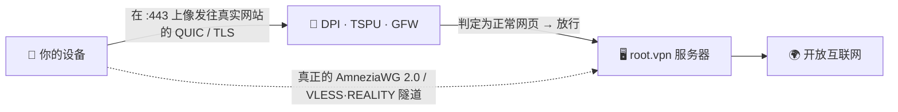

<div align="center">

# 🛡️ root.vpn

### 一条命令部署、审查看不见的 VPN。

**AmneziaWG 2.0 + VLESS·REALITY 同端口，一行部署 —— 预调优为在俄罗斯 TSPU、中国 GFW、伊朗过滤网眼中“像普通上网流量”。**


<br>


**🌐 [English](README.md) · [Русский](README.ru.md) · 中文 · [Tiếng Việt](README.vi.md)**

</div>

```bash
git clone https://github.com/antidetect/root.vpn && cd root.vpn && sudo ./awg2
```

这一行就能立起一台加固的远程接入服务器，在 **443 端口上提供两条入口**，并打印二维码供你扫码连接。无需参数、无 Web 面板、无会泄密的仪表盘。

> [!WARNING]
> **先把话说清楚：** AmneziaWG 仅支持 UDP。在封禁*全部* UDP 的网络里，root.vpn 会自动为每个客户端提供**第二条 TCP/443 通道（VLESS + REALITY）**，照样能通。两扇门，一条命令。

---

## ✨ 为什么选 root.vpn

- 🥷 **不只是加密，而是隐形。** 裸 WireGuard/OpenVPN 极易被指纹识别，在 RU/CN/IR 早已失效。root.vpn 把*开场数据包*伪装成发往真实网站的 **QUIC 握手**，TCP 备用通道则**借用真实网站的 TLS**（REALITY）——主动探测只会看到那个真实网站。
- 🎲 **每台服务器都独一无二。** 垃圾包、逐消息填充、范围化报头与 QUIC 伪装签名都按**每次部署随机化**——没有可供统一封禁的特征。两次安装永不雷同。
- 🚪 **443 上 UDP *与* TCP 并存。** 默认走高速 AmneziaWG/UDP；UDP 被封或 DPI 严苛时回退到 VLESS+REALITY/TCP——同机共存、互不冲突。
- ⚡ **一条命令，服务器全包。** 装内核模块、生成密钥、构建配置、开防火墙、配 NAT、创建首个客户端并打印二维码。
- 🔒 **默认即加固。** 全局路由（不泄漏）、密钥 `0600` 归服务账户所有、**无访问日志**、systemd 沙箱、UFW + fail2ban。
- 🧾 **归你、MIT、可审计。** 在久经考验的 [`bivlked/amneziawg-installer`](https://github.com/bivlked/amneziawg-installer) + [Xray‑core](https://github.com/XTLS/Xray-core) 之上的一层精简可读封装。

## ✅ 真实服务器实测

这不是只过了语法检查的玩具。每条路径都在全新 **Ubuntu 24.04** VPS 上端到端跑通：

| 测试 | 结果 |
|---|---|
| AmneziaWG 2.0 (UDP/443) 真实客户端握手 + 流量 | **出口 IP = 服务器 ✓** |
| VLESS + REALITY + Vision (TCP/443) 经 SOCKS 真实客户端 | **出口 IP = 服务器 ✓** |
| IPv4 / **IPv6** / **DNS** 泄漏检测 | **无泄漏 ✓** |
| 防火墙：UFW `deny routed`、FORWARD `DROP`+`awg0 ACCEPT`、NAT MASQUERADE | **✓** |
| fail2ban（SSH 暴破） | **生效、正在封禁 ✓** |
| 客户端生命周期：add / remove / list / `rotate-reality` | **✓** |
| 跨安装器重启的幂等重跑 | **✓** |

> 这次实战排查发现并修复了约 10 个真实环境的 bug（多次重启处理、依赖缺失、REALITY 伪装目标选择、服务账户的文件归属等）——只有真正部署才能暴露。

## 🧬 它如何保持隐形

客户端的第一个数据包是**诱饵**：一个真实、每次部署唯一的 **QUIC v1 Initial**，其中的 TLS ClientHello 携带*你的* SNI（按 RFC 9000/9001 离线构造，并用 `aioquic` 栈验证过）。在审查者看来，会话像普通的 443 端口 HTTP/3；随后才是真正的 AmneziaWG 握手（垃圾包 + 填充 + 范围化报头），服务器静默忽略诱饵。TCP 备用通道用 **REALITY**——它中继一个真实第三方网站的 TLS 握手，因此探测你的服务器只会得到那个真实网站。



## ⚔️ 对比

| | 裸 WireGuard | 原版 OpenVPN | 普通 AmneziaWG | **root.vpn** |
|---|:---:|:---:|:---:|:---:|
| 抵御 RU/CN/IR 的 DPI | ❌ | ❌ | ⚠️ | ✅ |
| 协议伪装（QUIC/REALITY） | ❌ | ❌ | ⚠️ 部分 | ✅ |
| 抗主动探测 | ❌ | ❌ | ⚠️ | ✅（REALITY） |
| UDP 被封网络的 TCP/443 回退 | ❌ | ⚠️ | ❌ | ✅ |
| 每次部署唯一特征 | ❌ | ❌ | ⚠️ | ✅ |
| 一条命令、无面板 | ⚠️ | ⚠️ | ⚠️ | ✅ |
| 全局隧道并经泄漏测试 | ⚠️ | ⚠️ | ⚠️ | ✅ |

## 🚀 约 60 秒安装

**你需要：** 全新的 **Ubuntu 24.04 / Debian 12** VPS（建议 1 GB 内存；内存不足脚本会加 swap），IP 信誉干净（避开被封的 VPS 网段），并以 root 运行。

```bash
# 1) 获取
git clone https://github.com/antidetect/root.vpn
cd root.vpn

# 2)（推荐）在 defaults.conf 里选一个低调的 REALITY 伪装目标
#    nano defaults.conf  ->  REALITY_DEST="dl.google.com"   （留空则自动选）
#    以及 QUIC SNI：          AWG_SNI="www.cloudflare.com"

# 3) 运行（这就是全部安装）
sudo ./awg2
```

全新镜像上，底层安装器会重启一两次以加载新内核——**每次重启后再次运行 `sudo ./awg2`** 即可，它会安全续跑。完成后你会看到 `all checks passed`、首个客户端的**两个二维码**以及一个 `vless://` 链接。

> 完整的客户端指引——各平台用哪个 App、如何导入——见 **[docs/USAGE.md](docs/USAGE.md)**。

## 🎛️ 管理

```bash
sudo awg2 add laptop                  # 在两条腿上新建客户端 → 两个二维码 + vless:// 链接
sudo awg2 add guest --expires=7d      # 自动过期客户端
sudo awg2 remove laptop               # 全部吊销
sudo awg2 list                        # 所有客户端，两条腿
sudo awg2 status                      # 接口、端口、混淆概览
sudo awg2 rotate-sni <域名>           # 更换 QUIC SNI + 重生成客户端
sudo awg2 rotate-reality              # 更换 REALITY 密钥 + 重新导出链接
sudo awg2 rotate-reality-target <主机># 更换 REALITY 伪装目标
sudo awg2 uninstall
```

## 📲 连接你的设备

每个客户端会获得**两个配置**——先试 AmneziaWG；UDP 被封时用 VLESS。

| 平台 | AmneziaWG (UDP) | VLESS·REALITY (TCP) |
|---|---|---|
| Windows | AmneziaVPN | v2rayN / Hiddify |
| macOS | AmneziaVPN | Hiddify / Streisand / FoXray |
| Android | AmneziaWG / AmneziaVPN | Hiddify / v2rayNG |
| iOS | AmneziaVPN | FoXray（免费）/ Streisand |
| Linux | `awg-quick` / AmneziaVPN | Hiddify / NekoRay / mihomo |

👉 **逐步导入 + 排错 + 泄漏检查：** [docs/USAGE.md](docs/USAGE.md)

## 🎚️ 隐身档位

| 档位 | 方案 | 适用 |
|---|---|---|
| **Good**（默认） | AWG/UDP + VLESS‑REALITY‑**Vision** TCP/443 | 偏中国、重速度、用户少 |
| **Better** | TCP 腿走 **XHTTP + mux**（`TCP_TRANSPORT="xhttp"`） | 俄罗斯（挺过 2025-11 TSPU 对 Vision 的封锁） |
| **Max** | + CDN 前置 XHTTP+TLS、后量子 VLESS 加密 | 伊朗白名单、敌对 ASN |

详情与工程取舍：**[docs/DESIGN‑v2‑tcp‑masking.md](docs/DESIGN-v2-tcp-masking.md)**。

## 🛡️ 默认加固

全局隧道 · UFW（`deny routed`）+ fail2ban · `net.ipv6.disable_ipv6=1`（无 v6 泄漏）· NAT MASQUERADE + `FORWARD DROP` · REALITY 私钥与客户端密钥 `0600` 归服务账户 · **Xray 访问日志关闭**（磁盘无客户端 IP/SNI）· systemd 沙箱（`NoNewPrivileges`、`ProtectSystem=strict`、仅 `CAP_NET_BIND_SERVICE`）· 固定上游版本 · 逐次部署随机化混淆。

## ⚠️ 诚实的局限

- **IP/ASN 信誉胜过任何协议。** 在被封 VPS 网段上，握手成功但数据随即中断——请用信誉干净/住宅出口。
- **REALITY 伪装目标很关键。** 用干净的 TLS1.3+HTTP/2 站点（`dl.google.com`、`www.lovelive-anime.jp`）；**避免**证书链巨大的站点（`microsoft.com`、`amazon.com`）——会破坏 REALITY 握手。root.vpn 自带经过验证的默认列表并会校验你的选择。
- **客户端锁定。** AWG 2.0 由 Amnezia App 支持；TCP 腿由 Xray 系 App 支持。单 App 自动回退（Mihomo）在路线图上。
- **信任。** 它以 root 运行固定版本的上游代码——请审阅，必要时固定 `UPSTREAM_SHA256`。

## 📚 文档

- 📖 [客户端使用指南](docs/USAGE.md) — 连接任意设备
- 🏗️ [v2 设计](docs/DESIGN-v2-tcp-masking.md) — 架构、威胁映射、档位

## 🙏 鸣谢与许可

基于 [`bivlked/amneziawg-installer`](https://github.com/bivlked/amneziawg-installer) 与 [amnezia‑vpn](https://github.com/amnezia-vpn)（AmneziaWG 2.0）+ [XTLS/Xray‑core](https://github.com/XTLS/Xray-core)（VLESS·REALITY）。离线 QUIC‑Initial 生成器遵循 RFC 9000/9001，为原创实现。见 [NOTICE](NOTICE)。

**MIT** © 2026 —— 见 [LICENSE](LICENSE)。用于合法的隐私与反审查用途；你需自行遵守适用于你的法律。
