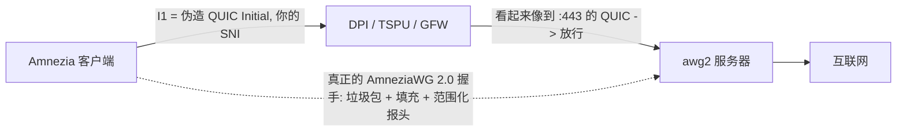

<div align="center">

# 🛡️ amneziawg-hardened &nbsp;·&nbsp; `awg2`

### 在全新 VPS 上一条命令 → 一台预先调优、可绕过*严苛* DPI 的 **AmneziaWG 2.0** 远程接入服务器。


**🌐 [English](README.md) · [Русский](README.ru.md) · 中文 · [Tiếng Việt](README.vi.md)**

</div>

> [!WARNING]
> **AmneziaWG 仅支持 UDP。** 它伪装成 QUIC/DNS/SIP，但没有 TCP 传输。在封禁*全部* UDP、或只允许 TCP‑443 通往 CDN 的网络中，它**无法连接**。请在同一台机器上保留 **OpenVPN+Cloak** 或 **VLESS+REALITY**（TCP/443）作为后备。参见[诚实的局限](#️-诚实的局限)。

---

## ✨ 为什么有这个项目

`awg2` 是在优秀的 [`bivlked/amneziawg-installer`](https://github.com/bivlked/amneziawg-installer)（MIT）之上的一层轻量、有主见的**覆盖层**。该安装器完成了繁重工作——DKMS 编译、对 `Jc/Jmin/Jmax/S1–S4/H1–H4` 的逐次部署随机化、客户端/二维码生成、俄罗斯运营商预设。`awg2` 在其之上增加三点：

1. **默认即加固**——无需记忆任何参数。全局路由 + UDP/443 已内置。
2. **真正的 QUIC 伪装，离线生成。** 上游把 QUIC `I1` 丢给浏览器工具；大家都复制同一个 `SNI=7‑zip.org` 的数据块，这恰恰*毁掉*了 AmneziaWG 2.0 的核心（逐次部署的唯一性）。`awg2` 在本地**每次都生成一个全新、合法、唯一、携带你自己 SNI 的 QUIC v1 Initial**。
3. **版本固定。** 上游每天都在变；`awg2` 将其固定，因此你的加固不会“失效”。升级只需改一个变量。

## 🎯 “加固”内置了什么

| 项目 | 默认值 | 原因 |
|---|---|---|
| 🧅 隧道 | **全局**（`--route-all`） | 不会有流量绕过隧道泄漏 |
| 🔌 端口 | **UDP/443** | 与 QUIC / HTTP‑3 融为一体 |
| 🎭 `I1` 伪装 | **真实 QUIC Initial + 你的 SNI** | 既能骗过*分类* QUIC 的 DPI，也能骗过*解密 Initial 并读取 SNI* 的 DPI（如 GFW） |
| 🎲 `Jc/Jmin/Jmax/S1–S4/H1–H4` | **逐次部署**随机 | 无通用特征；`H` 区间互不重叠且 ≤ INT32_MAX |

## 🧬 QUIC 伪装如何工作

客户端最先发送的是 `I1`——一个**诱饵包**。`awg2` 把它做成一个真正的 QUIC Initial，其中的 TLS ClientHello 携带*你的* SNI。在审查者看来，会话像是普通的 HTTP/3 到 443 端口；随后才是真正的 AmneziaWG 握手（垃圾包、逐消息填充、范围化报头），服务器则静默忽略诱饵。



## 🚀 快速开始

```bash
git clone https://github.com/antidetect/amneziawg-hardened
cd amneziawg-hardened

# 设置唯一的开关：用于 QUIC 伪装的低调 SNI（见 defaults.conf）
#   nano defaults.conf   ->   AWG_SNI="static.licdn.com"

sudo ./awg2
```

这会安装 AmneziaWG 2.0、应用加固配置、创建第一个客户端 `phone` 并打印其二维码。请用 **Amnezia 客户端 ≥ 4.8.12.9** 导入（目前只有它支持 AWG 2.0）。

> 留空 `AWG_SNI` 也能工作——会退化为*仅形态*的 QUIC 伪装（看起来像 QUIC，但不含 SNI）。面对严苛 DPI，请设置真实 SNI。

## 🔑 唯一的开关——你的 SNI

内置的 SNI 是你唯一需要选择的东西。请选一个对你出口节点所在地区**合理且低调**的域名，并且**每次部署都不同**。

| | 域名 |
|---|---|
| ✅ **推荐** | 低调的 CDN / 金融 / 政府 / 企业主机（如 `www.gov.uk`、`static.licdn.com`、某个小型 SaaS 域名） |
| ❌ **避免** | `youtube.com`、`*.cloudflare.com`、Discord、Telegram CDN、`*.googlevideo.com`、STUN 主机——已被封或与基础设施重叠 |

这是个不断变化的目标。若线路变差：`sudo awg2 rotate-sni new.example.com`。

## 🎛️ 命令

| 命令 | 作用 |
|---|---|
| `sudo ./awg2` | 加固安装（读取 `defaults.conf`） |
| `sudo awg2 add <名称> [--expires=7d] [--psk]` | 新建客户端 + 二维码 |
| `sudo awg2 remove <名称>` | 吊销客户端 |
| `sudo awg2 list -v` | 列出客户端 |
| `sudo awg2 status` | 接口 + 混淆参数概览 |
| `sudo awg2 rotate-sni <域名>` | 新 QUIC SNI，重新应用并重生成所有客户端 |
| `sudo awg2 rotate-i1` | 全新 QUIC Initial（SNI 不变） |
| `sudo awg2 uninstall` | 全部移除 |

> 执行 `rotate-sni` / `rotate-i1` 后，请从 `/root/awg/` **重新分发**更新后的客户端配置——`I1` 必须在服务器与每个客户端上逐字节一致。`awg2` 将不一致视为致命错误，因此绝不会被静默下发。

## 🧱 加固默认值（`defaults.conf`）

```ini
AWG_SNI=""              # ← 设置它。用于 QUIC 伪装的低调 SNI
AWG_PORT="443"          # UDP/443（与 QUIC/HTTP-3 融合）
AWG_TUNNEL="full"       # full = 全部流量 | amnezia = 分流
AWG_MIMICRY="quic"      # quic = 真实 Initial+SNI | shape = 仅形似 QUIC | off
AWG_PRESET=""           # "" | "mobile"（俄罗斯/伊朗蜂窝 DPI）
AWG_FIRST_CLIENT="phone"
UPSTREAM_VERSION="v5.18.1"   # 固定的上游安装器
```

## ✅ 经过验证，而非空谈

离线 QUIC 生成器 [`lib/quic_i1.py`](lib/quic_i1.py) 通过三种独立方式验证：

- 🧾 **RFC 9001 附录 A.1** 测试向量——Initial 的 key/iv/hp 推导与规范逐字节一致。
- 🔁 **往返自检**——构造数据包、去除报头保护、AEAD 解密、解析 ClientHello、断言 SNI。
- 🦺 **独立解析器（`aioquic`）**——一个独立且成熟的 QUIC 栈能从我们的包中恢复 SNI、ALPN `h3` 与加密套件。

```bash
python3 lib/quic_i1.py --selftest          # 构造 → 解密 → 校验 SNI 往返
python3 lib/quic_i1.py --sni www.gov.uk    # 打印 I1 = <b 0x...> 令牌
```

每次运行都生成**唯一**的数据包（随机连接 ID/密钥、GREASE、打乱的 TLS 扩展），因此任意两次部署都不会共享指纹。

## ⚠️ 诚实的局限

> [!CAUTION]
> 在依赖它对抗国家级审查者之前，请阅读以下内容。

- **仅 UDP**——见顶部警告。请保留 TCP 后备（OpenVPN+Cloak / VLESS+REALITY）。
- **IP/ASN 信誉至关重要。** 在知名 VPS 网段（如从俄罗斯访问的 Hetzner AS24940），握手可能完成，随后数据中断——这是 AS 级别的切断，而非参数问题。请使用干净 / 住宅信誉的出口。
- **SNI 会失效。** 安全的 SNI 是个移动目标 → `rotate-sni`。
- **客户端锁定。** 截至 2026 年中，只有 Amnezia 应用支持 AWG 2.0（Throne/Hiddify/sing‑box 尚不支持）。
- **信任。** `awg2` 以 root 运行一个固定版本的上游脚本。请阅读它（`less /root/awg-hardened/install_amneziawg_en.sh`），并可在 `defaults.conf` 中固定 `UPSTREAM_SHA256`。

## 📁 目录结构

```
awg2              加固入口（安装 + 管理代理 + 轮换）
defaults.conf     只需改一次的默认值（主开关为 AWG_SNI）
lib/quic_i1.py    离线 QUIC v1 Initial + SNI 生成器（RFC 9000/9001）
NOTICE / LICENSE  MIT；署名 bivlked/amneziawg-installer 与 amnezia-vpn
```

## 🙏 致谢与许可

基于 [`bivlked/amneziawg-installer`](https://github.com/bivlked/amneziawg-installer) 与 [amnezia‑vpn](https://github.com/amnezia-vpn) 项目——安装器与 AmneziaWG 2.0 协议的全部功劳归于他们。QUIC Initial 生成器遵循 RFC 9000 / RFC 9001，为原创实现。参见 [NOTICE](NOTICE)。

**MIT** © 2026 —— 见 [LICENSE](LICENSE)。用于合法的隐私 / 反审查用途；你需自行遵守适用于你的法律。
