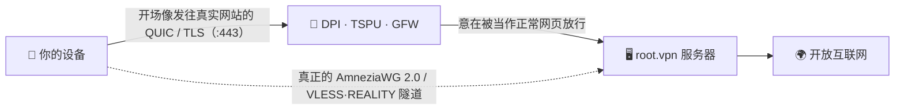

<div align="center">

# 🛡️ root.vpn

### 一条命令的 VPN，专为“在裸 WireGuard 被封的地方融入背景”而打造。

**一条命令部署 AmneziaWG 2.0 (UDP/443) + VLESS·REALITY (TCP/443) —— 采用协议伪装，设计上让流量像普通 QUIC/TLS，并针对俄罗斯、中国、伊朗所用的 DPI 手法。**


<br>

-16a34a?style=for-the-badge)


**🌐 [English](README.md) · [Русский](README.ru.md) · 中文 · [Tiếng Việt](README.vi.md)**

</div>

> [!IMPORTANT]
> **实话实说：** root.vpn 在**设计上**让流量像普通上网，并已在**真实服务器上端到端测试**（见下）。它**尚未**针对俄/中/伊的实网审查做测试——抗 DPI 是一种*设计属性*，而非经实地验证的结果。见[诚实的局限](#️-诚实的局限)。绝不卖“神油”。

## 安装（无需 git）

```bash
curl -fsSL https://raw.githubusercontent.com/antidetect/root.vpn/main/install.sh | sudo bash
```

这一行用 `curl`+`tar`（不需要 git）下载 root.vpn，在 **443 端口**立起一台加固的远程接入服务器，并打印二维码供你扫码连接。无参数、无 Web 面板、无会泄密的仪表盘。全新镜像上底层安装器会重启一两次以加载新内核——**每次重启后再次运行同一命令**即可，它会安全续跑。

默认提供 **443 上两条入口**：高速 **AmneziaWG/UDP** *与* 在 UDP 被封网络下使用的 **VLESS·REALITY/TCP** 备用（默认 `TCP_ENABLED=1`；设 `0` 则仅 AWG）。

> [!WARNING]
> AmneziaWG 仅 UDP。在封禁*全部* UDP 的网络里，客户端用**第二个配置（443 上的 VLESS + REALITY）**通过。两扇门，一条命令。

---

## ✨ 为什么选 root.vpn

- 🥷 **为融入而生，不只是加密。** 裸 WireGuard/OpenVPN 易被指纹识别、在 RU/CN/IR 被大面积封锁。root.vpn 把*开场数据包*伪装成发往真实网站的 **QUIC client Initial**，TCP 腿用 **REALITY** 中继真实第三方网站的 TLS 握手——主动探测你的服务器只会拿回那个真实网站。
- 🎲 **两次安装绝不雷同。** 垃圾包、逐消息填充、范围化报头和 QUIC 伪装开场都**按部署随机化**（连接 ID、TLS random、key share、GREASE、扩展顺序皆不同）。这消除了服务器间共享的静态字节特征——但**不**声称能击败 ML/连接模式分类器。
- 🚪 **443 上 UDP *与* TCP。** 同机共存、互不冲突——已在真机上验证两者都在监听。
- ⚡ **一条命令，其余交给服务器。** 装内核模块、生成密钥、构建配置、开防火墙、配 NAT、创建首个客户端并打印二维码。（需 root + 出站 HTTPS；新内核上可能重启续跑。）
- 🔒 **默认即加固。** 全局路由（在我们的受控测试中无泄漏）、UFW + fail2ban（上游），并在 TCP 腿上提供 **systemd 沙箱化的 Xray**，密钥 `0600` 归服务账户、**关闭访问日志**。
- 🧾 **归你、MIT、可审计。** 在 [`bivlked/amneziawg-installer`](https://github.com/bivlked/amneziawg-installer) + [Xray‑core](https://github.com/XTLS/Xray-core) 之上的一层精简可读封装。

## ✅ 真实服务器端到端测试

不只是 `bash -n`。每条路径都在全新 **Ubuntu 24.04** 上跑过（Debian 12 由安装器路径支持，但不在本次实测内）：

| 测试 | 结果 |
|---|---|
| AmneziaWG 2.0 (UDP/443)：真实客户端握手 + 经隧道流量 | **出口 IP = 服务器 ✓** |
| VLESS + REALITY + Vision (TCP/443)：经 SOCKS 真实客户端 *（用合适的 REALITY 伪装目标）* | **出口 IP = 服务器 ✓** |
| IPv4 / **IPv6** / **DNS** 泄漏检测 —— *在单机 network‑namespace E2E（实验室），非真实客户端网络* | **无泄漏 ✓** |
| 防火墙：UFW `deny routed`、FORWARD `DROP`+`awg0 ACCEPT`、NAT MASQUERADE | **✓** |
| fail2ban（SSH 暴破） | **生效、正在封禁 ✓** |
| 客户端生命周期：add / remove / list / `rotate-reality`；curl 安装路径 | **✓** |
| 跨安装器重启的幂等重跑 | **✓** |

> 本次实测发现并修复了约 10 个真实部署 bug（多次重启处理、缺失依赖、REALITY 伪装目标选择、服务账户文件归属等）——只有真实运行才能暴露。

## 🧬 它如何融入背景

客户端的*开场数据包*是**诱饵**：一个真实、按部署唯一的 **QUIC v1 Initial**，其 TLS ClientHello 携带*你的* SNI（按 RFC 9000/9001 离线构造；其 Initial 密钥与 RFC 9001 附录 A.1 测试向量一致，开发期间该包被独立的 `aioquic` 栈解析并还原出 SNI）。在审查者看来，会话*开头*像普通 443 HTTP/3；随后是真正的 AmneziaWG 握手，服务器忽略诱饵。**注意：** 只有第一个包伪装 QUIC——跟踪整条流的有状态分类器仍能看出它不是完整 HTTP/3 会话。TCP 腿用 **REALITY**，探测会得到真实第三方网站。



## ⚔️ 设计特性对比

*对比内置设计特性，而非实地结果。任何一项都未独立验证可绕过实网审查。*

| 特性 | 裸 WireGuard | OpenVPN (TLS/443) | 原版 AmneziaWG | **root.vpn** |
|---|:---:|:---:|:---:|:---:|
| 协议伪装 / 混淆 | ❌ | ⚠️ 需插件 | ✅ | ✅ |
| 抗主动探测的 TLS 腿 | ❌ | ⚠️ tls‑crypt | ❌ | ✅ REALITY（TCP 腿） |
| 443 上 UDP **与** TCP | ❌ | 仅 TCP | 仅 UDP | ✅ 两者 |
| 按部署随机化特征 | ❌ | ❌ | ⚠️ 手动 | ✅ |
| 一条命令 + 客户端 + 二维码 | ⚠️ | ⚠️ | ⚠️ | ✅ |
| 全局隧道、已查泄漏（实验室 E2E） | — | — | — | ✅ |

## 🚀 完整安装

**你需要：** 全新 **Ubuntu 24.04**（或 Debian 12）VPS——建议 1 GB 内存，内存不足脚本会加 swap——IP 信誉干净（避开被封 VPS 网段），并以 root 运行。

**最快（无需 git）：**
```bash
# 可用环境变量传配置（低调的 REALITY 伪装目标 + QUIC SNI）：
curl -fsSL https://raw.githubusercontent.com/antidetect/root.vpn/main/install.sh \
  | sudo REALITY_DEST=dl.google.com AWG_SNI=www.cloudflare.com bash
```

**或先下载再编辑后运行（同样无需 git）：**
```bash
curl -fsSL https://github.com/antidetect/root.vpn/archive/refs/heads/main.tar.gz | tar -xz
cd root.vpn-main
nano defaults.conf          # 设置 REALITY_DEST / AWG_SNI 等
sudo ./awg2
```

**或用 git：**
```bash
git clone https://github.com/antidetect/root.vpn && cd root.vpn && sudo ./awg2
```

完成后你会看到 `all checks passed`、首个客户端的二维码和一个 `vless://` 链接。各设备详细指引：**[docs/USAGE.md](docs/USAGE.md)**。

## 🎛️ 管理

```bash
sudo awg2 add laptop                  # 在两条腿上新建客户端 → 二维码 + vless:// 链接
sudo awg2 add guest --expires=7d      # 自动过期客户端
sudo awg2 remove laptop               # 全部吊销
sudo awg2 list                        # 所有客户端，两条腿
sudo awg2 status                      # 接口、端口、混淆概览
sudo awg2 rotate-sni <域名>           # 更换 QUIC SNI + 重生成客户端
sudo awg2 rotate-reality              # 更换 REALITY 密钥 + 重新导出链接
sudo awg2 rotate-reality-target <主机># 更换 REALITY 伪装目标
sudo awg2 uninstall
```

## 📲 连接你的设备

每个客户端获得一个 **AmneziaWG 配置**，以及（TCP 腿开启时）一个 **VLESS·REALITY 配置**——先试 AmneziaWG；UDP 被封时用 VLESS。

| 平台 | AmneziaWG (UDP) | VLESS·REALITY (TCP) |
|---|---|---|
| Windows | AmneziaVPN | v2rayN / Hiddify |
| macOS | AmneziaVPN | Hiddify / v2rayN |
| Android | AmneziaWG / AmneziaVPN | Hiddify / v2rayNG |
| iOS | AmneziaVPN | Streisand（免费）/ Shadowrocket（付费）/ Hiddify |
| Linux | `awg-quick` / AmneziaVPN | Hiddify / mihomo / `xray` |

👉 **逐步导入 + 排错 + 泄漏检查：** [docs/USAGE.md](docs/USAGE.md)

## 🎚️ 隐身选项

| 选项 | 方式 | 状态 |
|---|---|---|
| **默认** | AWG/UDP + VLESS‑REALITY‑**Vision** TCP/443 | ✅ 已测试基线 |
| **俄向加固** | TCP 腿走 **XHTTP**（`TCP_TRANSPORT="xhttp"`） | 针对所报 TSPU 封锁 Vision‑于‑443 的缓解；**未在实网 TSPU 验证** |
| **CDN 前置 / 后量子** | CDN 前置 XHTTP+TLS · VLESS 加密（ML‑KEM） | **实验性 / 手动**，默认关闭，不在测试基线内 |

工程取舍与威胁映射：**[docs/DESIGN‑v2‑tcp‑masking.md](docs/DESIGN-v2-tcp-masking.md)**。

## 🛡️ 加固

全局隧道 · UFW（`deny routed`）+ fail2ban（上游）· `net.ipv6.disable_ipv6=1`（无 v6 泄漏）· NAT MASQUERADE + `FORWARD DROP`。在 TCP/Xray 腿：REALITY 私钥 + Xray 配置 `0600` chown 给服务账户 · **关闭 Xray 访问日志**（其日志不含客户端 IP/SNI）· systemd 沙箱（`NoNewPrivileges`、`ProtectSystem=strict`、仅 `CAP_NET_BIND_SERVICE`）。上游按版本固定（可选 `UPSTREAM_SHA256` 按哈希固定，默认关闭）。混淆参数按部署随机化。

## ⚠️ 诚实的局限

- **未针对实网审查测试。** 绕过俄 TSPU / 中 GFW / 伊朗 DPI **未**经验证——这里的抗 DPI 是设计意图 + 实验室/功能验证，并非实地结果。
- **泄漏检测仅限实验室。** 在单机 network‑namespace E2E 中通过，*非*真实设备与接入网络。请在你的设备上验证（见 USAGE）。
- **只有第一个包伪装 QUIC。** 跟踪整条流的有状态分类器仍能区分；REALITY 的 TLS‑in‑TLS 只是提高了检测成本，并非隐形。
- **IP/ASN 信誉胜过任何协议。** 在被封 VPS 网段上，握手成功但数据随即中断——请用信誉干净/住宅出口。
- **REALITY 伪装目标很关键。** 用干净的 TLS1.3+HTTP/2 站点（`dl.google.com`、`www.lovelive-anime.jp`）；**避免**证书链巨大的站点（`microsoft.com`、`amazon.com`）——会破坏 REALITY 握手（测试已证实）。root.vpn 会校验并告警，但**分发客户端前请先测试你的伪装目标**。
- **暂无吞吐基准。** **Debian 12** 与进阶选项（XHTTP/CDN/PQ）不在已验证的 Ubuntu 24.04 基线内。
- **客户端锁定与信任。** AWG 2.0 需 Amnezia App；TCP 腿需 Xray 系 App。它以 root 运行固定版本上游代码——请审阅；需要时固定 `UPSTREAM_SHA256`。

## 📚 文档

- 📖 [客户端使用指南](docs/USAGE.md) — 连接任意设备
- 🏗️ [v2 设计](docs/DESIGN-v2-tcp-masking.md) — 架构、威胁映射、选项

## 🙏 鸣谢与许可

基于 [`bivlked/amneziawg-installer`](https://github.com/bivlked/amneziawg-installer) 与 [amnezia‑vpn](https://github.com/amnezia-vpn)（AmneziaWG 2.0）+ [XTLS/Xray‑core](https://github.com/XTLS/Xray-core)（VLESS·REALITY）。离线 QUIC‑Initial 生成器遵循 RFC 9000/9001，为原创实现。见 [NOTICE](NOTICE)。

**MIT** © 2026 —— 见 [LICENSE](LICENSE)。用于合法的隐私与反审查用途；你需自行遵守适用于你的法律。
